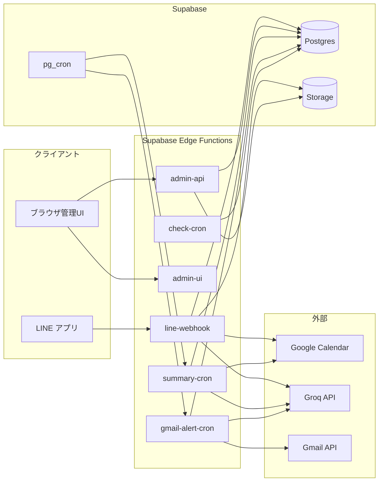

# LINE Management — 運用説明書

LINE のトークを Supabase に蓄積し、**Groq（Llama 3.3）** で意図を判定して次を実行する運用アプリです。

- **Google Calendar** への予定登録・照会（自然文・コマンド両対応）
- **会話検索**（トーク履歴＋アップロード資料の本文）
- **定期要約配信**（全体ルーム／ルーム別）
- **翌日予定通知**
- **Gmail** の予約系メールを検知して LINE 通知
- **LINE メディア**の取得・保存と、**資料ライブラリ**（TXT / PDF / Word / Excel）

バックエンドは **Supabase Edge Functions（Deno）**、データは **Postgres + Storage** です。

---

## 目次

1. [システム概要](#1-システム概要)
2. [アーキテクチャ](#2-アーキテクチャ)
3. [コンポーネント別の役割](#3-コンポーネント別の役割)
4. [静的 UI の公開方法](#4-静的-ui-の公開方法)
5. [LINE 上でできること（利用者向け）](#5-line-上でできること利用者向け)
6. [ルーム設定と挙動マトリクス](#6-ルーム設定と挙動マトリクス)
7. [AI（Groq）の役割と閾値](#7-aigroqの役割と閾値)
8. [会話検索の仕様](#8-会話検索の仕様)
9. [資料ライブラリと本文抽出](#9-資料ライブラリと本文抽出)
10. [管理 API（admin-api）リファレンス](#10-管理-apiadmin-apiリファレンス)
11. [データベース](#11-データベース)
12. [Storage](#12-storage)
13. [RPC（代表）](#13-rpc代表)
14. [環境変数（Secrets）一覧](#14-環境変数secrets一覧)
15. [セットアップとデプロイ](#15-セットアップとデプロイ)
16. [スケジュール（pg_cron）と DB カスタム設定](#16-スケジュールpg_cronと-db-カスタム設定)
17. [定数・上限値一覧](#17-定数上限値一覧)
18. [セキュリティ](#18-セキュリティ)
19. [GitHub Actions](#19-github-actions)
20. [トラブルシューティング](#20-トラブルシューティング)
21. [ローカル開発メモ](#21-ローカル開発メモ)
22. [変更履歴（抜粋）](#22-変更履歴抜粋)

**管理画面のチェック・テーブル別の詳細**は [docs/ADMIN_UI_GUIDE.md](./docs/ADMIN_UI_GUIDE.md) を参照してください。  
README 以外の Markdown は [`docs/`](./docs/) にまとめています（`APP_ANALYSIS.md`、`SECURITY_AUTOMATION.md`、`ADMIN_DASHBOARD.md` など）。

---

## 1. システム概要

| 区分 | 内容 |
|------|------|
| 受信 | LINE Messaging API Webhook → `line-webhook` |
| 管理 | ブラウザ UI → `admin-api`（JSON API） |
| 定期 | `summary-cron`（要約・翌日通知・メッセージ保持クリーンアップ等）、`gmail-alert-cron`（Gmail 予約通知）、`calendar-pending-cron`（期限切れ確認待ちの自動登録） |
| 診断 | `check-cron`（DB 直結で cron / 設定スナップショット） |
| データ | Postgres（メッセージ・設定・ログ・資料メタ等）、Storage（メディア・資料ファイル） |

メッセージは原則すべて `line_messages` に保存されます。テキスト以外はプレースホルダ文＋メディアタグで保存し、画像等は Content API 経由で Storage に格納します。

新規に Bot が入ったルームは、初期状態では未承認（権限OFF）として扱います。管理画面で権限をONにするまで会話検索・予定確認などは実行されません（返信可否はルームポリシー設定に従います）。

---

## 2. アーキテクチャ



---

## 3. コンポーネント別の役割

### 3.1 `line-webhook`

- **POST** のみ。`LINE_CHANNEL_SECRET` 設定時は **署名ヘッダ必須**（欠如／不一致は 403）。
- イベントごとに `line_messages` へ保存。テキスト以外は `toStoredMessageContent` により種別ごとの説明文（例: `【画像が送信されました】[[MEDIA:…]]`、位置情報・スタンプ等も区別）。
- 保存対象メディア種別: `image`, `video`, `audio`, `file`（定数 `STORABLE_LINE_MEDIA_TYPES`）。取得後 `line-media` バケットへアップロードし `line_message_media` にメタデータ保存。
- トークから **保存メディアの署名付きダウンロード URL** を返す文言: `メディアURL`（省略時は**このトーク**の最新 1 件）、`メディアURL 2`〜`3`（当該ルームのみ・新しい順に最大 3 件）。**`メディアURL 全ルーム`** または **`メディアURL 3 全ルーム`** のように **`全ルーム` を付けると**、友だち 1:1（`U` 始まりの room_id）を除く **グループ／複数人トーク**に保存されたメディアを、会話検索と同様に **ユーザー権限の検索対象外ルーム**を除いて新しい順に返す（`line-webhook`）。**友だち 1:1 でも**、メディア保存が有効で `can_media_access` があれば保存・URL 返却可。1:1 の**テキスト**は履歴 DB に載せず、**メディア行のみ**保存する。
- メディア: ルーム別・合計容量上限、1 ファイル上限（設定値と LINE 20MB 上限の両方）を実装。
- テキストメッセージ: 明示コマンド解析、**pending カレンダー確認**、**Groq 一次意図判定**（calendar 作成／一覧／会話検索／none）、各種ヒューリスティック（単発・複数イベント告知、検索っぽい自然文など）。
- 新規ルーム初期制御: `room_summary_settings` が未承認状態（主要フラグOFF）の場合は管理者申請案内を返し、機能実行を停止。
- 権限不足時応答: ルームが有効でも必要権限が不足している質問には、固定文（`この質問は、現在このルームで権限が付与されていないため実行できません。`）を返す。
- 返信は LINE Reply API。最大 **5 メッセージ**に分割する制御あり。

### 3.2 `admin-api`

- すべて **`x-admin-token`** 必須。トークンは DB の **SHA-256 ハッシュ**と比較（`secureEqual`）。DB にハッシュが無い場合は `ADMIN_DASHBOARD_TOKEN`（平文）との照合のみ。
- 設定・メディア・資料・ルーム削除・要約手動起動など REST 風エンドポイントを提供（詳細は [§10](#10-管理-apiadmin-apiリファレンス)）。
- **資料 POST `/documents`**: `multipart/form-data` の **`file` のみ**受理（クライアントからの `extracted_text` は受け付けない）。サーバ側で TXT / PDF / DOCX / XLSX の本文抽出し `line_search_documents.extracted_text` に保存。

### 3.3 `admin-ui`

- Edge Function から **単一 HTML** を返す管理画面（`referrerPolicy: no-referrer`、外部 CDN フォント不使用）。
- 内部で `admin-api` と同じオリジンの相対パスではなく、**Supabase Functions の URL** へ `fetch` する実装（デプロイ先 URL に依存）。

### 3.4 `summary-cron`

- pg_cron 等から定期起動。全体／ルーム別の **要約配信**、**翌日予定通知**、**メッセージ保持期間**に基づくクリーンアップ、`message_cleanup_timing` / `last_delivery_summary_mode` に応じた処理分岐。
- 要約文面生成に **Groq**（`llama-3.3-70b-versatile`）を使用。
- Gmail 関連の補助処理（環境変数に応じ）を含む場合あり（実装参照）。

### 3.5 `gmail-alert-cron`

- **毎分**想定で起動（pg_cron ジョブ `gmail-alert-cron-job`）。
- Gmail API で unread を検索（デフォルトクエリ: `is:inbox is:unread newer_than:7d (予約 OR reservation OR booking)`）。ルール抽出に加え、設定により **Groq** で予約情報抽出。
- 通知済みは `gmail_reservation_alert_logs` で重複防止。ルーム別 `gmail_reservation_alert_enabled` 等に連動。

### 3.6 `check-cron`

- 環境変数 **`SUPABASE_DB_URL`**（Postgres 接続文字列）必須。`postgresjs` で SSL 接続。
- `cron.job` 一覧、`invoke_summary_cron` / `invoke_gmail_alert_cron` の定義先頭、`summary_settings`、`custom.*` 設定の有無などを JSON で返す診断用。**スキーマは変更しない。**

### 3.7 リポジトリ内の静的ファイル

| ファイル | 役割 |
|----------|------|
| `index.html` | 管理画面（プロジェクト URL 固定表示、`localStorage` に管理トークン） |
| `media.html` | メディア一覧・容量・**資料ライブラリ**（アップロードは `admin-api` へ FormData） |
| `admin-dashboard/index.html` | `../index.html` へリダイレクト |
| `admin-dashboard/media.html` | `../media.html` へリダイレクト |

---

## 4. 静的 UI の公開方法

Edge Functions のデプロイだけでは **`index.html` / `media.html` は自動では本番に載りません。** 次のいずれかで配信してください。

- **GitHub Pages**（本リポジトリのワークフロー `pages build and deployment` と併用）
- 任意の静的ホスティング（S3 + CloudFront、Netlify、Vercel 等）
- Supabase Storage 等への手動アップロード＋適切な CORS／認証設計

管理画面の API 呼び出し先は、HTML 内の **`FIXED_PROJECT_URL`**（または同等のベース URL）と、ブラウザに保存したトークンに依存します。リポジトリをフォーク／複製した場合は **自プロジェクトの Supabase URL に合わせて変更**してください。

---

## 5. LINE 上でできること（利用者向け）

### 5.1 明示コマンド（ルールベース優先）

- **予定登録**: `予定登録 YYYY-MM-DD HH:mm [durationMin] タイトル`、および `予定追加 …`（同一系）
- **予定変更**: `予定変更 <eventId> | 件名=... | 日付=YYYY-MM-DD | 時刻=HH:mm | 所要=分 | 場所=...`（必要な項目だけ指定、`場所=なし` でクリア）
- **予定確認**: `予定確認`, `予定一覧`, `予定報告` ＋ スコープ表現（今日／来週／日付 等）
- **会話形式の予定変更**: 予定確認の直後30分以内は、`時間を19:00に変更` や `2件目の件名を...に変更` のように続けて変更可能
- **会話検索**: `会話検索` / `トーク検索` / `履歴検索` / `チャット検索` ＋ `要約|確認` などのプレフィックスにマッチする場合も明示扱い（`isExplicitBotCommandText`）

### 5.2 会話検索（ルールパース）

次を満たすと「会話検索コマンド」としてパースされます。

- **明示**: 文頭付近に `会話|トーク|履歴|チャット` ＋ `検索|要約|確認|まとめ…` の組合せ、**または**
- **自然文**: `会話|トーク|履歴|チャット|メッセージ|発言` かつ `検索|教えて|ありますか|記述|言及…` 等の意図語を含む

**期間**（`detectMessageSearchDays`）: `全期間|無制限|すべて…` → 0 日。`60/120/180/365/730/1095` 日や `半年` `1年` 等の別表記。未指定時は DB の `message_retention_days` を既定に使用。

**スコープ**（`detectMessageSearchScope`）: `このルーム|このグループ|…` → `current_room`。`全ルーム|他ルーム|…` → `all_rooms`。**既定は `all_rooms`**。

**通常の会話検索の日付上限**（`MESSAGE_SEARCH_NORMAL_MAX_DAYS`）: 保持がそれより長くても、**既定は過去 180 日まで**を段階検索の対象にする（DB 上の削除・保持設定は変えない）。**保持期間いっぱいまで**対象にしたいときは、明示コマンドで **`会話検索フル`** / **`会話検索全履歴`** / **`会話検索裏`** / **`会話検索フルスキャン`**（`トーク検索…` 等も可）または **`フル会話検索`** のように指定する。**自然文のみの AI 検索経路**にフル指定はなく、このモードは明示パース時のみ。

キーワードは上記語を除去して抽出。空ならエラーメッセージを返します。

会話検索の実行順は次の通りです。

- まず `line_messages`（保存済みの LINE 会話ログ）のみ検索
- ヒットが 0 件のとき、**資料ライブラリ検索に進むかを確認**（`はい` / `いいえ`、30 分有効）
- `はい` の場合のみ `line_search_documents` を検索（**`original_file_name` に `[LINE]` を含む資料だけ**を対象）

追加の運用制御:

- 検索ヒット候補から、Bot への質問文（例: `〜について教えて`）のようなプロンプトメッセージを除外
- 自動検索対象にならない通常文質問には、無言で終わらず **`会話検索 <キーワード>` の形式案内**を返す

### 5.3 登録前確認（pending）

低信頼・要確認のカレンダー登録は `calendar_pending_confirmations` に保持。**有効期限 5 分**。ユーザーは `はい` / `いいえ` で確定・キャンセルでき、pending 中は「場所を…変更」「時間を…」「件名を…」などの **修正文**にも対応（実装: `looksLikePendingCorrectionText` 等）。  
5 分を過ぎても返信がない場合は破棄せず、件名末尾に `（仮）` を付けて自動登録します（`calendar-pending-cron` が毎分確認）。Webhook 側は期限超過を検知した場合、即時登録を行わず「バックグラウンド処理待ち」の案内を返します。

また、次の pending も保持します。

- `message_search_expand_pending_confirmations`: 段階検索が早い段階で終わったあとの「さらに古い会話帯を検索するか」確認
- `message_search_library_pending_confirmations`: 会話検索ヒット 0 件時の「資料ライブラリも検索するか」確認
- `calendar_update_pending_targets`: 予定確認直後の会話形式変更（例: `2件目の時間を19:00に変更`）の対象候補。返信先メッセージID（`source_line_message_ids_json`）も保持

### 5.4 自然文によるカレンダー／検索

- Groq で `create_calendar` / `list_calendar` / `search_messages` / `none` を判定（詳細ルールはプロンプト内。業務連絡・周知・添付共有は基本 `none`）。
- 一次判定がカレンダー作成を取りこぼした場合の **フォールバック**: 「単発イベント告知」「複数日程リスト」などのヒューリスティックで `forceAiCalendarCreate` 等を立てる経路あり。

#### 自動登録とは

`自動登録` は、LINE の自然文メッセージから「予定登録意図あり」と判定できた場合に、**明示コマンドなしで Google カレンダーへ予定登録**する機能です。

#### 自動登録の主な動作条件

- グローバル設定 `CALENDAR_AI_AUTO_CREATE_ENABLED=true`（未設定時は有効扱い）
- ルーム設定 `calendar_ai_auto_create_enabled=true`
- AI 判定が `create_calendar` かつ十分な信頼度
- 日付・時刻・件名が解釈可能

#### どんな文が登録されやすいか（例）

- `5/10 14:00 試飲会を入れて`
- `来週火曜17時から打ち合わせ`
- `2026-05-10 19:00 シェフ会議`

#### 登録されにくい文（例）

- `会議資料共有します`
- `提出期限は◯日です`
- `@All 共有です`
- 日時が曖昧な文、周知・依頼のみの文

#### 補足

- グループ/複数人ルームでは、Botは原則サイレント運用です。**予定登録・予定変更として解釈できた場合のみ返信**し、それ以外は履歴収集のみ行います。
- 1:1 ルーム（`source.type=user`）は別ポリシーで、**常に返信**します。意図不明時も無視せず、追加情報を要求する返信を返します。
- 判断が低信頼の場合は pending（確認待ち）に入り、`はい` / `いいえ` で確定・中止できます。返信がない場合は 5 分経過後、cron処理で `（仮）` 付き自動登録されます。

### 5.5 メッセージ種別の保存表現（検索対象の `content`）

| LINE `type` | 保存例 |
|-------------|--------|
| `text` | 本文そのまま |
| `image` / `video` / `audio` / `file` | `【…が送信されました】` ＋ `[[MEDIA:lineMessageId]]`（該当時） |
| `location` | 位置情報の説明 |
| `sticker` | スタンプ送信の説明 |
| その他 | `【その他のメディア (type) が送信されました】` |

- 履歴保存ポリシー:
  - `source.type=user`（1:1）は保存しない。
  - 1:1以外（group/room）は、通常トークとBot向け質問を含めて保存する（検索母集団確保のため）。
  - ただし会話検索表示時はノイズ抑制のため、Bot向け質問文を除外して表示する。

---

## 6. ルーム設定と挙動マトリクス

`room_summary_settings` を中心に、次が LINE 応答・処理に効きます。  
管理UIでは誤設定防止のため、`bot_reply_enabled` / `message_search_enabled` / `message_search_library_enabled` は非表示です（表示されないが値は保持され、ルーム保存時に不意に上書きしない実装）。

| フラグ | 意味 |
|--------|------|
| `is_enabled` | ルームの Bot 処理全体の有効／無効 |
| `bot_reply_enabled` | ユーザーへの **返信** の有無 |
| `calendar_ai_auto_create_enabled` | AI による **自動カレンダー登録**（環境変数 `CALENDAR_AI_AUTO_CREATE_ENABLED` と併用） |
| `message_search_enabled` | **会話検索の応答**（低信頼時の確認プロンプト抑止にも影響） |
| `message_search_library_enabled` | 会話検索ヒット0件時の **資料ライブラリ検索（2段階目）** の可否 |
| `media_file_access_enabled` | LINEメディア（画像/動画/音声/ファイル）の **保存・アクセス** の可否 |
| `send_room_summary` | ルーム別要約配信 |
| `gmail_reservation_alert_enabled` | Gmail 予約通知のルーム配信 |
| `calendar_tomorrow_reminder_enabled` | 翌日予定通知（全体設定と組合せ） |

**要点**

- 新規ルーム未登録状態（`room_summary_settings` 行なし）は未承認扱い。管理UIでルーム行を作成した場合は、画面のチェック値で保存される。
- `is_enabled=false` → **返信・AI 判定・（通常の）登録処理はしない**。ただし **メッセージ保存とメディア保存は継続**。
- group/room はサイレント運用を基本とし、予定登録・予定変更と判定したときだけ返信する。
- 1:1 は例外で常時返信し、意図不明時もフォールバック返信を返す。
- 非表示フラグ（`bot_reply_enabled` / `message_search_enabled` / `message_search_library_enabled`）は、既存値を維持したままルーム保存される。
- `media_file_access_enabled=false` の場合、対象ルームでは `[[MEDIA:...]]` タグ付与とメディア実体保存を行わない（テキスト記録のみ）。

### 6.1 ユーザー別権限（`line_user_permissions`）

ルーム権限に加えて、`line_user_id` 単位の追加制御が可能です。最終可否は **ルーム権限 AND ユーザー権限** です。

| カラム | 意味 |
|--------|------|
| `is_active` | ユーザー全体の有効/無効 |
| `can_message_search` | 会話検索の可否 |
| `can_library_search` | 資料ライブラリ検索（2段階目）の可否 |
| `can_calendar_create` | カレンダー新規登録の可否 |
| `can_calendar_update` | カレンダー更新（編集・削除相当）の可否 |
| `can_calendar_view` | カレンダー一覧・確認・閲覧（検索）の可否 |
| `can_media_access` | メディア保存・参照の可否 |

**予定まわりの整理**: **予定閲覧**（`can_calendar_view`）は「予定確認」「◯月の会議は」などの **一覧・閲覧専用**。**予定作成**・**予定更新**とは別フラグ。`line-webhook` では一覧系は閲覧権限のみで判定します。

**管理 UI の連動**: 「予定閲覧」を OFF にすると、同じ行の「予定作成」「予定更新」チェックも自動で OFF になります。`PUT /permissions/users` でも **`can_calendar_view` が `false` のときは `can_calendar_create` / `can_calendar_update` を常に `false` で保存**します（API 直叩きでも整合）。

管理画面（`admin-ui` / `index.html`）の「ユーザー権限」セクションから JSON 一括編集できます。  
未登録ユーザーは既定で許可扱い（互換性重視）です。

利用可能な API:

- `GET /permissions/users`（一覧取得）
- `PUT /permissions/users`（upsert）
- `DELETE /permissions/users/:line_user_id`（削除）

### 6.2 ルーム一覧の「メンバー同期」（グループ／複数人トーク）

管理画面 **ルーム別設定** の一覧で、ルーム ID が **グループ（`C…`）または複数人トーク（`R…`）**の行にのみ **メンバー同期** ボタンが表示されます（1対1の `U…` には非表示）。

- 実行すると `POST /rooms/sync-chat-members` が LINE Messaging API の **`members/ids`**（`next` によるページング）で、そのトークに参加している **全メンバーの userId** を取得し、`line_user_permissions` に反映します。
- **既存の権限行**は変更せず、表示名（と `updated_at`）を更新。**未登録の userId** は Webhook で新規作成されたときと同じ既定（未承認・各権限 OFF 等）で INSERT されます。
- **LINE 側の制約**: `members/ids` は **認証済みまたはプレミアム**の LINE 公式アカウントに限定。未認証では **403**。その場合はメッセージ応答に理由と代替（メッセージ受信 Webhook／「既存ユーザー取込」）を含めます。審査通過後は同じボタンで再実行可能です。

---

## 7. AI（Groq）の役割と閾値

- **API**: `https://api.groq.com/openai/v1/chat/completions`
- **モデル（現行実装）**: **`llama-3.3-70b-versatile`**（`line-webhook` / `summary-cron` / `gmail-alert-cron`）
- **温度**: 意図系は `0`

`line-webhook` における信頼度の目安（定数）:

| 定数 | 値 | 用途の一例 |
|------|-----|------------|
| `AI_MIN_CONFIDENCE` | 0.82 | 一次意図の採用 |
| `AI_CONFIRMATION_MIN_CONFIDENCE` | 0.68 | 確認プロンプト |
| `AI_LIST_MIN_CONFIDENCE` | 0.72 | カレンダー一覧系 |
| `AI_MESSAGE_SEARCH_MIN_CONFIDENCE` | 0.72 | 会話検索の AI 抽出 |
| `AI_PRIMARY_INTENT_MIN_CONFIDENCE` | 0.72 | 主意図 |
| `AI_PRIMARY_INTENT_CONFIRM_MIN_CONFIDENCE` | 0.60 | 主意図の確認 |
| `GMAIL_ALERT_AI_MIN_CONFIDENCE`（gmail-alert-cron） | 0.55 | メール本文からの予約抽出 |

### 7.1 検索処理と Groq トークン（要点）

- **会話検索・資料ライブラリ検索の「検索そのもの」**（キーワードで母集団を絞る処理）は **Groq を使わない**。DB に保存済みのテキストに対する **ルールベースの照合**である（§8.5）。
- Groq が関わるのは **意図判定・JSON 抽出・会話ヒットの要約**など **別経路**であり、**1 年分のトークが溜まったからといって、検索のたびに全文が LLM に送られる設計ではない**。
- そのため **蓄積文字数 ∝ Groq 従量** にはならず、**AI 使用量は RAG 全文投入型に比べて大幅に抑えられる**構造になっている。詳細は **§8.5**。

`GROQ_API_KEY` が無い場合、Groq 依存の経路はスキップ／縮退します。

---

## 8. 会話検索の仕様

### 8.0 利用者向け（フロー全体）

| 種別 | 入力例 | 何が起きるか（保持が長い場合の目安） |
|------|--------|--------------------------------------|
| **通常** | `会話検索 キーワード` | **第1段** 過去 180 日（保持が短ければその範囲）を一括 → **第2段** 0 件かつ保持がより長ければ同一応答内でフル相当 → **第3段** 会話でも 0 件なら資料ライブラリへ `はい`/`いいえ` |
| **フル（省略）** | `会話検索フル キーワード` 等 | 第1・2段を飛ばし、保持期間いっぱいまで段階検索。会話 0 件なら第3段（資料確認）へ |

- **保持日数**（全体設定）と **第1段の上限（180 日）**は別。保持が 2 年でも、通常は第1段は最大半年相当まで。
- パース条件: `detectFullRetentionSearchRequest` / `extractMessageSearchKeyword`（`line-webhook`）。

### 8.1 実装（取得・段階・テーブル）

**対象テーブル**: 会話は `line_messages` のみ（資料は第3段で `line_search_documents`）。

**日数とモード**

- `resolveEffectiveMessageSearchDays` → 通常は **`MESSAGE_SEARCH_NORMAL_MAX_DAYS`（180）** で頭打ち。
- **通常**: 第1段 `buildMessageSearchPhase1WizardWindows`（一括）。0 件かつ保持が第1段より長ければ第2段 `buildMessageSearchStageDayWindows` を同一リクエストで続行。第1段が保持と同じ範囲なら第2段スキップ。
- **明示フル**: いきなり `buildMessageSearchStageDayWindows`（約90日→約180日→残りの段階。**ヒットが出た段階で打切**）。段階あたり最大 **`MESSAGE_SEARCH_STAGE_HARD_MAX_ROWS`（200,000）** 件。

**キーワード取得**

- 優先: RPC `search_line_messages_keyword_window`（期間・ルーム・**トークン AND / 類義語 OR** を SQL で事前絞り込み。マイグレーション `20260415140000_*`）。
- 未適用時: 従来の新しい順バッチ取得へフォールバック。
- いずれも返却行は **`messageMatchesKeyword` で再検証**（NFKC・コンパクト一致など）。

**その他**

- スコープ: `current_room` は `room_id` 固定、全ルームは除外リスト適用。
- **古い帯の追加**: 段階の早い段でヒットしたが未走査の帯がある場合、`message_search_expand_pending_confirmations` 経由で `はい` / `さらに検索` 等（30 分）。
- **資料（第3段）**: `message_search_library_pending_confirmations`。資料は `[LINE]` 付きのみ、最大 300 件、保持日数は問わない。

### 8.2 ヒット判定

- 資料は `original_file_name + "\n" + extracted_text` を連結してキーワード照合。
- キーワードは **空白・読点でトークン分割**し、**各トークンがすべて一致**すればヒット（AND）。トークンは `expandKeywordVariants` により **類義語展開**（例: `ミーティング` ↔ `meeting` ↔ `会議` 等のグループ、`KEYWORD_SYNONYM_GROUPS`）。
- 正規化: Unicode NFKC、小文字化、記号・空白の調整、**コンパクト比較**（句読点・空白除去）による部分一致も併用。
- Bot 宛の質問文っぽいメッセージ（`〜について教えて` など）は検索ヒットから除外（自己参照ノイズ抑制）。

### 8.3 結果表示と要約

- 件数が多い場合は **分割送信**と注釈。
- いずれかの段階で **1 段階あたり 200,000 件**に達した場合、**「新しい順に最大 200,000 件まで走査」** の注釈を付与（通常の保持日数・トーク量では不要なことが多い）。
- 資料検索に進んだ場合、資料 300 件上限の注釈を付与。
- ヒットが適量のとき **Groq による要約**（要約対象行の上限: `SEARCH_MAX_SUMMARY_ROWS` 120、AI 入力用ヒット上限 `SEARCH_AI_SUMMARY_MAX_HITS` 80）。
- 一致メッセージ本文は文区切り（`。！？`）を優先した表示で可読性を確保。
- 資料抜粋は「一致文（文単位）」を優先表示し、該当文が取れない場合のみキーワード前後の文字列切り出しへフォールバック。
- 画面折返しの都合で不自然にならないよう、資料抜粋は固定文字数での強制改行を行わない（`、` では段落分割しない）。
- 検索結果の `日時` は **西暦を含む** 表示（例: `2026/04/11 03:38`）。
- 資料検索結果の時刻表示は、`日時` ではなく **`資料登録日時`** として明示する（会話発生時刻との混同防止）。
- `txt` 由来資料では、本文中から推定できる場合に **`トーク日時`** を併記する（抽出不能時は省略）。

### 8.4 保持期間との関係

`message_retention_days` は **会話検索の対象期間の上限**に効く（第1段・第2段の計算に入る）。  
**資料ライブラリ（第3段）**は日数でクリップせず、登録済み `[LINE]` 資料全体を対象にする。

### 8.5 データ構造・検索方式と AI（Groq）使用量

本システムでは **「履歴や資料の総量」**と **「Groq に課金されるトークン」** を切り離している。これにより **検索・閲覧に比例した LLM 従量が発生しない**。

#### 会話履歴（`line_messages`）

| 項目 | 内容 |
|------|------|
| 保存のされ方 | **メッセージごとに 1 行**（受信のたびに `content` 等が追加）。1 年分が溜まっても **1 本の長文ファイルにまとめ直す処理はしない**。 |
| 検索のされ方 | 期間・ルームで **PostgREST/SQL 的に行を取得**し、アプリ側で **キーワードルール**（`messageMatchesKeyword` 等）に一致する行だけを残す。**LLM は使わない**。 |
| Groq が絡むとき | **ヒット行の要約**などに限り、**件数・1 行あたり文字に上限**（例: `SEARCH_AI_SUMMARY_MAX_HITS`、`summarizeMessageSearchHitsWithGroq` 内の切り詰め）。**全文をプロンプトに載せない**。 |

#### 資料ライブラリ（`line_search_documents`）

| 項目 | 内容 |
|------|------|
| 保存のされ方 | アップロード時に **サーバ側で本文抽出**し、`extracted_text` に格納（§9）。 |
| 検索のされ方 | `original_file_name` と `extracted_text` を対象に **キーワード照合**し、表示は **スニペット生成などルールベース**。**資料ライブラリ検索の結果生成に Groq は使わない**（`buildLineTaggedDocumentLibrarySearchReply`）。 |

#### RAG との違い（呼び方）

- **RAG（Retrieval-Augmented Generation）** では、取得したチャンクを **LLM が読んで生成**するのが典型。本実装の **検索ヒット処理**は **取得＋ルール表示が主**で、資料経路は **LLM による生成を伴わない**。
- よって **「キーワード検索＋DB 保存テキスト」に近い情報検索**であり、**意味ベクトル検索でもない**。

#### 運用上の意味

- トークが **年単位で増えても**、それは **DB 行数・ストレージ・読み取りバッチ**の話であり、**検索一回あたりの Groq 入力が総文字数に比例して増えるわけではない**。
- **Groq 使用量を押し上げる**のは主に **意図判定の回数・要約を付けた検索の回数・ヒット件数**であり、単に「データが大きい」こと自体が直結しない。

---

## 9. 資料ライブラリと本文抽出

### 9.1 アップロード

- **経路**: 管理 UI（`media.html`）→ `POST /documents`（`admin-api`）。
- **上限**: **20MB 未満**（バイト厳密、`DOCUMENT_UPLOAD_MAX_BYTES`）。
- **許可 MIME / 拡張子**: `text/plain`（`.txt` 等）、`application/pdf`、`application/vnd.openxmlformats-officedocument.wordprocessingml.document`（`.docx`）、`application/vnd.openxmlformats-officedocument.spreadsheetml.sheet`（`.xlsx`）。**旧形式 `.doc` / `.xls` は非対応**。

### 9.2 抽出（すべてサーバ側）

| 形式 | 実装概要 |
|------|-----------|
| TXT | UTF-8 デコード（失敗時も fatal で落とさない） |
| PDF | `pdfjs-dist`（esm.sh 経由で動的 import）最大 **120 ページ**、抽出文字列全体 **最大 25 万文字** |
| DOCX | JSZip で OOXML 展開、`word/*.xml` を DOMParser で解析しテキスト化 |
| XLSX | `sharedStrings.xml` ＋ `xl/worksheets/*.xml` からセル値を再構成 |

- 抽出結果は **`normalizeExtractedText`** で長さカット（最大 **250,000 文字**）。
- Office XML は **エントリ数・1 ファイルあたり展開サイズ**に上限あり（Zip 爆発対策）。

### 9.3 検索との関係

`line_search_documents.extracted_text` が会話検索の対象になるため、**クライアントで抽出したテキストを送る必要はありません**（送られても使わない設計）。

---

## 10. 管理 API（admin-api）リファレンス

**認証**: 全エンドポイント `Header: x-admin-token: <token>`

**CORS**: `Access-Control-Allow-Origin: *`（プリフライト対応）。

| メソッド | パス | 説明 |
|---------|------|------|
| GET | `/state` | 全体設定、ルーム設定、`get_room_overview`、配信ログ（フィルタ後）、ストレージ使用量。クエリ: `logs_limit`（10–30、既定 30） |
| GET | `/gmail/account` | Gmail OAuth 設定の有効性・プロフィール確認 |
| GET | `/media` | メディア一覧。クエリ: `limit`（1–100、既定 24）、`offset`、`room_id`、`media_type`（image/video/audio/file）。署名付き URL・前後文脈付き |
| DELETE | `/media/:id` | メディア削除（Storage + メタデータ） |
| GET | `/documents` | 資料一覧。クエリ: `limit`（1–100、既定 20）、`offset`、`room_id`。スニペット・署名付きダウンロード URL |
| POST | `/documents` | `multipart/form-data`: `file` 必須、`room_id` / `room_name` 任意 |
| DELETE | `/documents/:id` | 資料削除 |
| PUT | `/settings/media-upload-limit` | JSON: `media_upload_max_mb`（1–20） |
| PUT | `/auth/token` | JSON: `new_token`（8 文字以上）→ DB ハッシュ更新 |
| PUT | `/settings/global` | 全体設定 upsert（配信時刻、保持、翌日通知、rollup 等） |
| PUT | `/settings/rooms` | ルーム設定 upsert |
| DELETE | `/settings/rooms/:room_id` | ルーム設定行のみ削除 |
| GET | `/permissions/users` | LINE user 単位の権限一覧（`limit` / `offset` / `q`） |
| PUT | `/permissions/users` | LINE user 権限 upsert |
| DELETE | `/permissions/users/:line_user_id` | LINE user 権限削除 |
| DELETE | `/rooms/:room_id` | **ルームのメッセージ・メディア・資料・設定を削除**（破壊的操作） |
| POST | `/actions/run-summary` | JSON: `force`（boolean、省略時 true）→ `invoke_summary_cron` 実行とログ待機 |
| POST | `/rooms/sync-chat-members` | JSON: `room_id`（必須、**グループ `C…` または複数人トーク `R…`**）→ LINE `members/ids` で全メンバーを取得し `line_user_permissions` に反映（既存行は権限を維持し表示名を更新、新規は Webhook 新規ユーザーと同様の既定で挿入）。**LINE 仕様上 `members/ids` は認証済／プレミアムの公式アカウントのみ** — 未認証では 403 となる |

パスは `/functions/v1/admin-api` プレフィックスを除いた形でもルーティングされます（実装: `normalizePath`）。

---

## 11. データベース

### 11.1 テーブル一覧と役割

| テーブル | 役割 |
|----------|------|
| `line_messages` | LINE 受信メッセージ本体（`id` UUID、`room_id`, `user_id`, `content`, `created_at`, `processed`） |
| `summary_settings` | **1 行固定**（`id=1`）全体設定: 配信時刻、有効フラグ、メッセージクリーンアップタイミング、要約モード、**メッセージ保持日数**、翌日通知、**メディアアップロード上限 MB**、管理トークン **ハッシュ** 等 |
| `room_summary_settings` | ルーム別: 名称、有効、返信、要約、各種機能 ON/OFF、並び順、継承可能な時刻・モード |
| `summary_delivery_logs` | 要約 cron 実行ログ（JST 時刻、ステータス、LINE 送信成否、`details` jsonb 等） |
| `calendar_pending_confirmations` | カレンダー確認待ち（期限、ステータス、タイトル／日時／所要時間分等） |
| `calendar_update_pending_targets` | 予定確認後の会話形式変更で使う対象候補（期限、対象イベント配列、返信元 LINE メッセージID 配列、ステータス） |
| `message_search_expand_pending_confirmations` | 段階検索の早終了後の「古い帯の追加検索」確認（キーワード・期間・スコープ、`stage_windows` / `next_ring_k`、期限、ステータス） |
| `message_search_library_pending_confirmations` | 会話検索ヒット 0 件時の資料検索確認（キーワード・期間・スコープ、期限、ステータス） |
| `line_message_media` | LINE メディアの Storage メタデータ |
| `line_search_documents` | 検索用資料（ファイル情報、**extracted_text**、`source` は `manual_upload` / `line_import` / `system_import`） |
| `line_user_permissions` | LINE user 単位の機能権限（検索/資料検索/予定閲覧/予定作成/予定更新/メディア/有効） |
| `gmail_reservation_alert_logs` | Gmail メッセージ ID 単位の通知済み記録 |
| `security_rate_limits` | 共有レート制限カウンタ（bucket + window 単位 hit 数、更新時刻） |

### 11.2 RLS

各テーブルは RLS 有効。**`service_role` の JWT** を前提としたポリシー（Edge Functions はサービスロールで接続）。

---

## 12. Storage

| バケット | 用途 | 備考 |
|----------|------|------|
| `line-media` | LINE から取得したメディア | マイグレーション上のバケット `file_size_limit` は 50MB 設定だが、**アプリ側で 20MB・合計 2GB** を強制 |
| `line-documents` | 資料ファイル | **admin-api は 20MB 未満**でアップロード |

---

## 13. RPC（代表）

| 名前 | 用途 |
|------|------|
| `invoke_summary_cron(force_run boolean)` | 要約・関連処理の手動／cron 起動 |
| `invoke_summary_cron()` | 引数なし版（スケジュール用） |
| `invoke_gmail_alert_cron()` | Gmail アラート Edge 起動 |
| `resolve_edge_cron_auth_token()` | cron invoker 用 Bearer を `custom.cron_auth_token` → `vault(CRON_AUTH_TOKEN)` → `vault(SUPABASE_ANON_KEY)` の順で解決 |
| `consume_security_rate_limit(rate_bucket, window_seconds, max_hits)` | DB共有レート制限カウンタ更新（許可可否・リトライ秒を返却） |
| `cleanup_security_rate_limits(retention interval)` | 古いレート制限履歴の削除（既定 2 日） |
| `get_room_overview()` | 管理画面用ルーム概要 |
| `get_storage_usage_stats()` | DB／主要テーブルサイズ |
| `get_line_media_usage_stats(filter_room_id, filter_media_type)` | メディア容量集計 |
| `get_line_document_usage_stats(filter_room_id)` | 資料容量集計 |

---

## 14. 環境変数（Secrets）一覧

### 14.1 必須に近い（基本動作）

| 変数 | 用途 |
|------|------|
| `SUPABASE_URL` | Supabase プロジェクト URL（Edge に自動注入される場合あり） |
| `SUPABASE_SERVICE_ROLE_KEY` | DB・Storage 管理（Edge に自動注入される場合あり） |
| `LINE_CHANNEL_SECRET` | Webhook 署名 |
| `LINE_CHANNEL_ACCESS_TOKEN` | 返信・Push |
| `LINE_OVERALL_ROOM_ID` | 全体要約・フォールバック送信先 |
| `ADMIN_DASHBOARD_TOKEN` | 管理 API ブレークグラス用／初期トークン |
| `GROQ_API_KEY` | 意図判定・要約・検索要約・Gmail AI 抽出 |

### 14.2 Google Calendar

| 変数 | 用途 |
|------|------|
| `GOOGLE_CALENDAR_ID` | 書き込み先カレンダー |
| `GOOGLE_SERVICE_ACCOUNT_EMAIL` | サービスアカウント |
| `GOOGLE_SERVICE_ACCOUNT_PRIVATE_KEY` | PEM（改行エスケープに注意） |
| `GOOGLE_CALENDAR_TIMEZONE` | 省略時 `Asia/Tokyo` |

### 14.3 Gmail 通知

| 変数 | 用途 |
|------|------|
| `GMAIL_ALERT_ENABLED` | 機能 ON/OFF |
| `GMAIL_CLIENT_ID` / `GMAIL_CLIENT_SECRET` / `GMAIL_REFRESH_TOKEN` | OAuth |
| `GMAIL_ALERT_QUERY` | 検索クエリ（省略時デフォルト） |
| `GMAIL_ALERT_MAX_MESSAGES` | 1 回あたり最大（アプリ側で上限クリップあり） |
| `LINE_GMAIL_ALERT_ROOM_ID` | フォールバック送信ルーム |
| `GMAIL_ALERT_AI_ENABLED` | AI 抽出の有効化 |
| `GMAIL_ALERT_AI_MAX_BODY_CHARS` | AI に渡す本文最大長（上下限あり） |

### 14.4 その他

| 変数 | 用途 |
|------|------|
| `CALENDAR_AI_AUTO_CREATE_ENABLED` | `false` で AI 自動登録を環境全体で抑止（ルーム設定と併用） |
| `SUPABASE_DB_URL` | **`check-cron` のみ必須**（postgres 接続文字列） |
| `CRON_AUTH_TOKEN` | （推奨）DB の cron invoker から Edge 呼び出し時に使う Bearer トークン。`vault` に保存して平文固定値を使わない |

`.env.example` にローカル用の雛形あり。

> セキュリティ方針: リポジトリ内に平文シークレットを置かない。Edge Functions は `supabase secrets set`、DB 側は `vault`（`vault.decrypted_secrets`）または `custom.cron_auth_token` を使用。

---

## 15. セットアップとデプロイ

1. `supabase link --project-ref <project-ref>`
2. `supabase db push`
3. `supabase secrets set KEY=VALUE --project-ref <project-ref>`（上記 Secrets）
4. 関数デプロイ:

```bash
supabase functions deploy line-webhook --project-ref <project-ref>
supabase functions deploy summary-cron --project-ref <project-ref>
supabase functions deploy gmail-alert-cron --project-ref <project-ref>
supabase functions deploy calendar-pending-cron --project-ref <project-ref>
supabase functions deploy admin-api --project-ref <project-ref>
supabase functions deploy admin-ui --project-ref <project-ref>
supabase functions deploy check-cron --project-ref <project-ref>
```

5. LINE Developers で Webhook URL:

```text
https://<project-ref>.supabase.co/functions/v1/line-webhook
```

6. **静的 HTML** をホスティングし、必要なら **プロジェクト URL を HTML 内で一致**させる（[§4](#4-静的-ui-の公開方法)）。

### 15.1 本番向け一括デプロイ例

```bash
# 1) DBマイグレーション同期
supabase db push

# 2) Edge Functions デプロイ
PROJECT_REF=<project-ref>
for fn in line-webhook summary-cron gmail-alert-cron calendar-pending-cron admin-api admin-ui check-cron; do
  supabase functions deploy "$fn" --project-ref "$PROJECT_REF"
done
```

### 15.2 本番疎通テスト（デプロイ直後）

#### A. 無認証到達チェック（公開到達の確認）

```bash
BASE="https://<project-ref>.supabase.co/functions/v1"
curl -i "$BASE/admin-ui"          # 200 を期待
curl -i "$BASE/admin-api/state"   # 401 を期待（x-admin-token 未指定）
curl -i "$BASE/line-webhook"      # 405 を期待（GET なので Method not allowed）
curl -i "$BASE/summary-cron"      # 401 を期待（Authorization 未指定）
curl -i "$BASE/gmail-alert-cron"  # 401 を期待（Authorization 未指定）
curl -i "$BASE/calendar-pending-cron"  # 401 を期待（Authorization 未指定）
curl -i "$BASE/check-cron"        # 401 を期待（Authorization 未指定）
```

#### B. 認証付き動作チェック（cron系）

```bash
PROJECT_REF=<project-ref>
ANON_KEY=$(supabase projects api-keys --project-ref "$PROJECT_REF" --output json \
  | jq -r '.[] | select(.name=="anon" or .name=="publishable") | .api_key' | head -n1)

BASE="https://${PROJECT_REF}.supabase.co/functions/v1"
curl -sS -H "Authorization: Bearer ${ANON_KEY}" "$BASE/summary-cron" | jq
curl -sS -H "Authorization: Bearer ${ANON_KEY}" "$BASE/gmail-alert-cron" | jq
curl -sS -H "Authorization: Bearer ${ANON_KEY}" "$BASE/calendar-pending-cron" | jq
curl -sS -H "Authorization: Bearer ${ANON_KEY}" "$BASE/check-cron" | jq
```

期待値（最低ライン）:

- `summary-cron`: HTTP 200（配信対象が無い時間帯でも `message` を返して正常終了）
- `gmail-alert-cron`: HTTP 200（`ok: true`）
- `calendar-pending-cron`: HTTP 200（`ok: true`）
- `check-cron`: HTTP 200（`success: true`、`cronJobs` が取得できる）

#### C. 管理 API（admin-api）の実動確認

`admin-api` は `x-admin-token` 必須のため、別途管理トークンを使って以下を確認します。

```bash
ADMIN_TOKEN=<admin-dashboard-token>
BASE="https://<project-ref>.supabase.co/functions/v1"
curl -sS -H "x-admin-token: ${ADMIN_TOKEN}" "$BASE/admin-api/state" | jq
curl -sS -H "x-admin-token: ${ADMIN_TOKEN}" "$BASE/admin-api/documents?limit=1" | jq
```

確認ポイント:

- 401 にならない（認証OK）
- `room_settings` や `summary_settings` が取得できる
- `documents` の一覧取得が成功する

---

## 16. スケジュール（pg_cron）と DB カスタム設定

| ジョブ名 | スケジュール（マイグレーション既定） | 呼び出し |
|----------|--------------------------------------|----------|
| `summary-cron-job` | 毎時 `0 * * * *` | `select public.invoke_summary_cron();` |
| `gmail-alert-cron-job` | 毎分 `* * * * *` | `select public.invoke_gmail_alert_cron();` |
| `calendar-pending-cron-job` | 毎分 `* * * * *` | `select public.invoke_calendar_pending_cron();` |
| `security-rate-limit-cleanup-job` | 毎日 `17 3 * * *` (UTC) | `select public.cleanup_security_rate_limits(interval '2 days');` |

**推奨（本番）**

- `custom.edge_function_url` … `summary-cron` の URL（任意）
- `custom.gmail_alert_edge_function_url` … `gmail-alert-cron` の URL（任意）
- `custom.calendar_pending_edge_function_url` … `calendar-pending-cron` の URL（任意）
- `custom.cron_auth_token` … Edge 呼び出し用 Bearer（任意）

URL 未設定時は、各 invoker がプロジェクトの Edge Function URL へフォールバックします。  
cron Bearer は `resolve_edge_cron_auth_token()` が以下優先順位で解決します。

1. `custom.cron_auth_token`
2. `vault` の `CRON_AUTH_TOKEN`
3. `vault` の `SUPABASE_ANON_KEY`

上記いずれも未設定の場合は、invoker は警告ログを出して安全にスキップします。

---

## 17. 定数・上限値一覧

### 17.1 `line-webhook`（抜粋）

| 項目 | 値 |
|------|-----|
| メディア 1 ファイル上限（絶対） | 20MB |
| メディア合計上限 | 2GB |
| 会話検索（会話ログ 1 段階あたりの走査上限） | 200,000 件（`MESSAGE_SEARCH_STAGE_HARD_MAX_ROWS`、バッチ読み取り） |
| 会話検索（通常モードの日数上限） | 180 日（`MESSAGE_SEARCH_NORMAL_MAX_DAYS`。フル指定時は保持設定まで） |
| 会話検索資料取得 | 300 件 |
| 検索要約用メッセージ | 最大 120 件まで要約入力 |
| AI 要約用ヒット | 最大 80 |
| カレンダー pending 有効期限 | 5 分 |
| 資料検索確認 pending 有効期限 | 30 分 |
| AI 自動登録イベント数上限 | 5 件 |
| 返信メッセージ分割 | 最大 5 |
| レート制限（IP単位） | 120 req / 60 秒 |
| レート制限（source単位） | 90 events / 60 秒 |

### 17.2 `admin-api`（資料）

| 項目 | 値 |
|------|-----|
| アップロード上限 | 20MB |
| 抽出テキスト最大 | 250,000 文字 |
| PDF 最大ページ | 120 |
| Office XML エントリ数上限等 | 実装定数参照（Zip 対策） |
| レート制限（通常 API） | 180 req / 60 秒 |
| レート制限（`POST /documents`） | 12 req / 60 秒 |

### 17.3 `gmail-alert-cron`（抜粋）

| 項目 | 値 |
|------|-----|
| デフォルト取得件数上限 | 5 |
| 設定可能上限（クリップ） | 20 |
| AI 本文デフォルト / 範囲 | 6000 文字前後、1500–12000 |

### 17.4 設定値の制約（API／DB）

- `message_retention_days`: `0 / 60 / 120 / 180 / 365 / 730 / 1095`
- `media_upload_max_mb`: `1..20`
- `calendar_tomorrow_reminder_max_items`: `1..50`
- `delivery_hours`, `calendar_tomorrow_reminder_hours`: `0..23` の整数配列
- `daily_rollup` 利用時: 全体は `message_cleanup_timing=end_of_day` 必須。ルームは `end_of_day` または `null`（継承）

---

## 18. セキュリティ

- **Git に秘密をコミットしない**（`.env` は `.gitignore`）。
- **管理 API** は `x-admin-token` 必須、DB には **トークンハッシュのみ**。
- **タイミング攻撃耐性**のある定時間比較（`secureEqual`）。
- 管理 UI / メディア UI / `admin-ui` の fetch は **`referrerPolicy: no-referrer`**。
- **外部 CDN のスクリプト・フォント依存を削減**（`media.html` の pdf.js 動的読み込み削除等）。
- 資料アップロードは **サーバ側抽出のみ**（クライアント `extracted_text` 不信頼）。
- 資料アップロードは MIME/拡張子に加えて **ファイルシグネチャ（magic bytes）** を検査。Office アーカイブはエントリ数・展開後サイズ・圧縮率・危険パスを検証（ZIP爆弾対策）。
- レート制限は **DB共有カウンタ（`security_rate_limits` + `consume_security_rate_limit`）** で実施。Edge インスタンス分散時でも一貫して制限可能。
- **Gitleaks** による Secret Scan（`.gitleaks.toml`）。Secrets は Supabase Secrets / Vault で管理し、Git に平文を残さない。

---

## 19. GitHub Actions

| ワークフロー | 内容 |
|--------------|------|
| `Secret Scan` | `gitleaks/gitleaks-action`（push / PR / 週次） |
| `rotation-reminder` | 月次ローテーションリマインダ Issue |
| `pages build and deployment` | 静的サイト（GitHub Pages） |

---

## 20. トラブルシューティング

| 現象 | 確認 |
|------|------|
| 予定が登録されない | `GOOGLE_CALENDAR_*`、カレンダー共有、サービスアカウント権限 |
| 要約が来ない | `summary_settings.is_enabled`、配信時刻、`LINE_OVERALL_ROOM_ID`、`summary-cron` ログ |
| 管理 API が 401 | `ADMIN_DASHBOARD_TOKEN` と DB の `admin_dashboard_token_hash`、入力トークン |
| Gmail 通知が来ない | `GMAIL_ALERT_ENABLED`、OAuth、ルームの `gmail_reservation_alert_enabled`、`gmail-alert-cron`／cron ジョブ |
| cron 不安 | `check-cron` 実行、`SUPABASE_DB_URL`、`cron.job` の active |
| 会話検索で資料がヒットしない | 期間内か、`extracted_text` が空でないか（画像 PDF・空ドキュメント）、資料は最大 300 件・新しい順 |
| 会話検索で「資料も検索しますか？」が出ない | 会話検索の自然文判定に入っていない可能性。`会話検索 <キーワード>` の明示形式で再確認 |
| 「さらに古い帯」の案内が出ない／続行できない | 段階が1段しかない（保持日数が短い等で窓が潰れている）場合や、すでに最終段でヒットした場合は追加帯なし。続行の保留が切れたら（30分超）会話検索をやり直す |
| 2年分を検索したいのに半年分しか出ない | **通常検索は過去180日まで**。保持期間いっぱいを対象にするには **`会話検索フル キーワード`**（または **全履歴／裏／フルスキャン** など）を付ける |
| 資料検索の抜粋に不要文が混ざる | 現在は一致文優先表示。抽出元に句点が少ない長文だとフォールバック切り出しが働くため、必要なら元資料の改行/句読点を調整 |
| メンバー同期が 403 | LINE 公式アカウントが **未認証**のとき `members/ids` は使えない（仕様）。**認証済／プレミアム**承認後に再実行。それまでは Webhook 受信・「既存ユーザー取込」で userId を取り込み |
| ルームのメディアが管理画面に増えない | ルーム設定 `media_file_access_enabled` が OFF の可能性。管理画面の「メディアアクセス」を確認 |
| グループで質問しても返信しない | 仕様です。group/room は予定登録・予定変更と判定できた場合のみ返信し、それ以外はサイレントで履歴収集のみ |
| 1:1で返信がない | 想定外です。最新デプロイ反映後も発生する場合は送信文をそのまま共有してください（意図不明フォールバック返信が返る仕様） |
| Secret Scan 失敗 | 新規に追加した文字列が JWT／API キー形式でないか、必要なら **Vault 化**または **gitleaks 設定の見直し**（安易な全域 allow は避ける） |

---

## 21. ローカル開発メモ

- Supabase CLI でローカル起動する場合、`.env.example` を参考に **サービスロール**等を設定。
- Edge Function の単体実行は `supabase functions serve`（バージョンに依存）。
- `check-cron` は **本番／ステージングの DB URL** が無いと動作しない。

---

## 22. 変更履歴（抜粋）

- **会話検索**: 第1段（最大180日一括）→ 第2段（必要時のみ同一応答内フル相当）→ 第3段（資料 `はい`/`いいえ`）。キーワードは **RPC 事前絞り込み**＋`messageMatchesKeyword` 再検証（`20260415140000_*`）。明示 `会話検索フル` は第1・2段省略。
- **ドキュメント**: `line_messages` / 資料ライブラリと Groq 使用量の関係を §7.1・§8.5、`ADMIN_UI_GUIDE` §5.8、`APP_ANALYSIS` に整理。
- **会話検索（段階・古い帯・RLS）**: 800 件打ち切り廃止、段階検索＋帯あたり最大 200,000 件。早期ヒット時は `message_search_expand_pending_confirmations` で未走査帯を追加。「続けて」単独は肯定にしない等の運用修正。followup pending の service_role ポリシーは短名固定（`20260415160000_*`、63 バイト識別子制限対策）。
- **ユーザー権限（予定閲覧）**: DB に `can_calendar_view` を追加。予定の一覧・確認は **閲覧権限のみ**で判定し、作成・更新権限と分離（`line-webhook`）。マイグレーション `20260413230000_add_can_calendar_view.sql`。
- **ユーザー権限（UI/API 整合）**: 管理画面で「予定閲覧」を OFF にすると「予定作成」「予定更新」も連動 OFF。`PUT /permissions/users` でも閲覧 OFF 時は作成・更新を強制 OFF。
- **ルーム別設定（メンバー同期）**: グループ／複数人トーク行に **メンバー同期** ボタンを追加。`POST /rooms/sync-chat-members` が LINE `members/ids` で全員分を `line_user_permissions` に取り込み。未認証チャネルでは 403 のため、**認証済／プレミアム**の公式アカウント向け。403 時は日本語で理由・代替手段を返す。
- **セキュリティ**: `media.html` の外部 pdf.js 削除、`referrerPolicy: no-referrer`、外部フォント `@import` 削除、資料 `extracted_text` のクライアント送信廃止。
- **会話検索（資料・運用）**: ヒット 0 件時の資料ライブラリ遷移、`[LINE]` 資料のみ、`message_search_library_enabled`。Bot 質問ノイズ除外・文区切り表示など。
- **メディアアクセス制御**: ルーム設定 `media_file_access_enabled` を追加し、ルーム単位でメディア保存・アクセスをON/OFF制御できるようにした。
- **運用ポリシー固定UI**: 管理画面から `会話検索応答` / `資料検索(2段階目)` / `自動応答` を非表示化し、誤設定を防止。
- **資料抜粋（可読性改善）**: 固定文字数改行を廃止し、文区切り表示へ統一。資料は一致文優先で抜粋し、不要な前後文の混入を抑制。
- **日時表示**: 検索結果の日時を西暦入りに統一（`YYYY/MM/DD HH:mm`）。
- **資料検索表示の明確化**: 期間表記を「登録済み[LINE]資料全体」に統一し、`資料登録日時` と `トーク日時`（抽出可能時）を区別して表示。
- **カレンダー**: `予定確認` 後の会話文（例: `2件目の時間を19:00に変更`）で、表示済み予定を会話方式で更新できるように拡張。
- **カレンダー（運用改善）**: 会話式予定変更で返信元メッセージID連動を追加し、対象取り違えを抑制。
- **カレンダー（誤判定抑制）**: 日付だけ変更発話で件名が変わる不具合、直前予定への誤更新（新規予定文の誤判定）を修正。
- **カレンダー（確認待ち運用）**: 低信頼の確認待ちは 5 分で期限切れとし、返信がない場合は `（仮）` 付きで自動登録する仕様へ変更。`calendar-pending-cron` を毎分実行して処理。
- **運用安定化**: `calendar-pending-cron` の外部成功/DB失敗時の再試行経路を修正し、`/settings/global` 保存時に `media_upload_max_mb` が暗黙で 10 に戻る不具合を解消。
- **UI保存安全化**: 管理UIの非表示フラグ（`bot_reply_enabled` / `message_search_enabled` / `message_search_library_enabled`）がルーム保存で勝手に固定値へ戻らないよう修正。
- **カレンダーメタ表示**: 説明欄メタを `room_id/user_id` から `room_name/user_name` 表示に変更（IDは内部プロパティに保持）。
- **1:1応答保証**: 1:1は常時返信し、意図不明時は無視せず追加情報要求のフォールバック返信を返す仕様へ統一。
- **権限フロー**: 新規ルームは未承認デフォルト（主要権限OFF）で開始し、管理者申請・権限付与後に機能解放。権限不足質問には固定拒否文を返す。
- **資料**: `admin-api` で PDF / DOCX / XLSX のサーバ側本文抽出、`line_search_documents.extracted_text` へ保存。
- **Secrets運用強化**: cron invoker のトークン解決を `custom` / `vault` ベースに統一し、平文トークンの埋め込みを廃止。
- **レート制限強化**: `admin-api` / `line-webhook` を DB共有レート制限へ移行（`security_rate_limits` / `consume_security_rate_limit`）。
- **保守運用**: `security-rate-limit-cleanup-job` を追加し、2日超のレート制限履歴を日次自動削除。
- **運用**: 本番デプロイ一括手順と、無認証/認証付きの本番疎通テスト手順を README に明文化。

---

*この文書はリポジトリの実装（Edge Functions・マイグレーション）に基づきます。挙動の最終確認はデプロイ環境で行ってください。*
