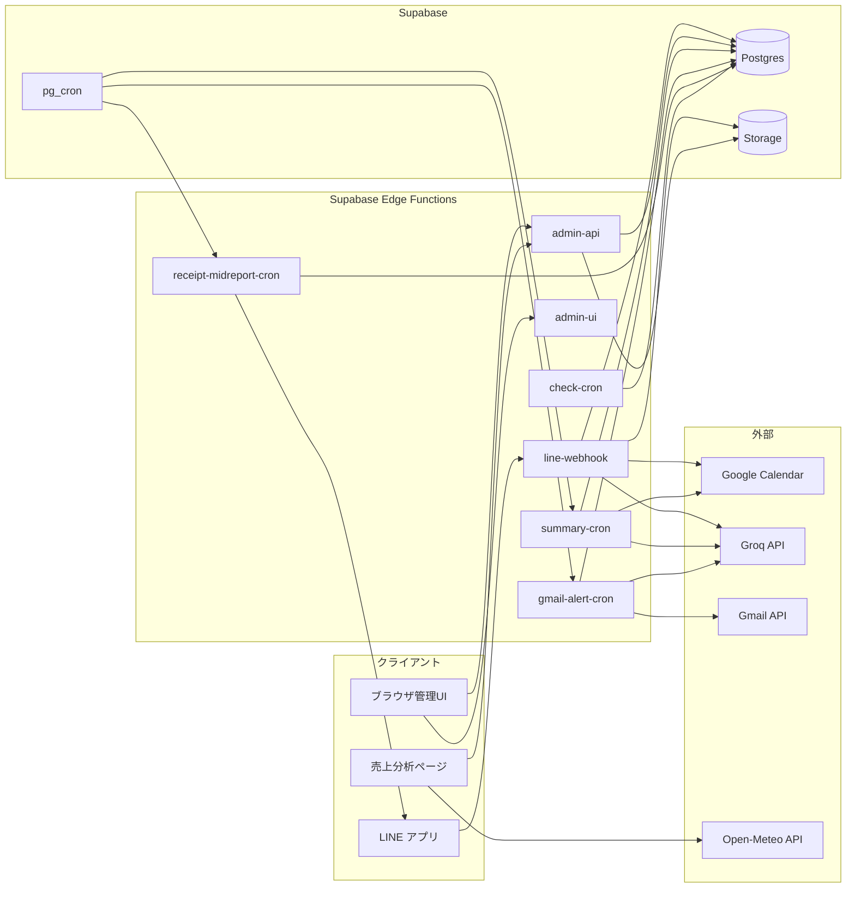

# LINE Management — 運用説明書

LINE のトークを Supabase に蓄積し、**Groq（Llama 3.3）** で意図を判定して次を実行する運用アプリです。

- **Google Calendar** への予定登録・照会（自然文・コマンド両対応）
- **会話検索**（トーク履歴＋アップロード資料の本文）
- **定期要約配信**（全体ルーム／ルーム別）
- **翌日予定通知**
- **Gmail** の予約系メールを検知して LINE 通知
- **LINE メディア**の取得・保存と、**資料ライブラリ**（TXT / PDF / Word / Excel）
- **レシート解析**（画像から売上・客数・組数を抽出し DB 保存）
- **売上分析ダッシュボード**（KPI・天候相関・曜日クロス表・月次推移）

バックエンドは **Supabase Edge Functions（Deno）**、データは **Postgres + Storage** です。

---

## 目次

1. [システム概要](#1-システム概要)
2. [アーキテクチャ](#2-アーキテクチャ)
3. [コンポーネント別の役割](#3-コンポーネント別の役割)
4. [静的 UI の公開方法](#4-静的-ui-の公開方法)
5. [LINE 上でできること（利用者向け）](#5-line-上でできること利用者向け)
6. [ルーム設定と挙動マトリクス](#6-ルーム設定と挙動マトリクス)
7. [AI（Groq）の役割と閾値](#7-aigroqの役割と閾値)
8. [会話検索の仕様](#8-会話検索の仕様)
9. [資料ライブラリと本文抽出](#9-資料ライブラリと本文抽出)
10. [売上分析ダッシュボード（analytics.html）](#10-売上分析ダッシュボードanalyticshtml)
11. [管理 API（admin-api）リファレンス](#11-管理-apiadmin-apiリファレンス)
12. [データベース](#12-データベース)
13. [Storage](#13-storage)
14. [RPC（代表）](#14-rpc代表)
15. [環境変数（Secrets）一覧](#15-環境変数secrets一覧)
16. [セットアップとデプロイ](#16-セットアップとデプロイ)
17. [スケジュール（pg_cron）と DB カスタム設定](#17-スケジュールpg_cronと-db-カスタム設定)
18. [定数・上限値一覧](#18-定数上限値一覧)
19. [セキュリティ](#19-セキュリティ)
20. [GitHub Actions](#20-github-actions)
21. [トラブルシューティング](#21-トラブルシューティング)
22. [ローカル開発メモ](#22-ローカル開発メモ)
23. [変更履歴（抜粋）](#23-変更履歴抜粋)

**管理画面のチェック・テーブル別の詳細**は [docs/ADMIN_UI_GUIDE.md](./docs/ADMIN_UI_GUIDE.md) を参照してください。  
README 以外の Markdown は [`docs/`](./docs/) にまとめています（`APP_ANALYSIS.md`、`SECURITY_AUTOMATION.md`、`ADMIN_DASHBOARD.md` など）。

---

## 1. システム概要

| 区分 | 内容 |
|------|------|
| 受信 | LINE Messaging API Webhook → `line-webhook` |
| 管理 | ブラウザ UI → `admin-api`（JSON API） |
| 定期 | `summary-cron`（要約・翌日通知・クリーンアップ等）、`gmail-alert-cron`（Gmail 予約通知）、`calendar-pending-cron`（確認待ちの自動登録）、`receipt-midreport-cron`（月次・中間売上レポートの LINE 配信） |
| 診断 | `check-cron`（DB 直結で cron / 設定スナップショット） |
| データ | Postgres（メッセージ・設定・ログ・資料・レシートデータ等）、Storage（メディア・資料ファイル） |

メッセージは原則すべて `line_messages` に保存されます。テキスト以外はプレースホルダ文＋メディアタグで保存し、画像等は Content API 経由で Storage に格納します。

新規に Bot が入ったルームは、初期状態では未承認（権限OFF）として扱います。管理画面で権限をONにするまで会話検索・予定確認などは実行されません。

---

## 2. アーキテクチャ


```mermaid
flowchart LR
  subgraph clients [クライアント]
    LINE[LINE アプリ]
    Browser[ブラウザ管理UI]
    Analytics[売上分析ページ]
  end
  subgraph edge [Supabase Edge Functions]
    WH[line-webhook]
    API[admin-api]
    UI[admin-ui]
    SUM[summary-cron]
    GMAIL[gmail-alert-cron]
    CHK[check-cron]
    MID[receipt-midreport-cron]
  end
  subgraph supa [Supabase]
    PG[(Postgres)]
    ST[(Storage)]
    CRON[pg_cron]
  end
  subgraph ext [外部]
    GCAL[Google Calendar]
    GROQ[Groq API]
    GAPI[Gmail API]
    WEATHER[Open-Meteo API]
  end
  LINE --> WH
  Browser --> API
  Browser --> UI
  Analytics --> API
  Analytics --> WEATHER
  WH --> PG
  WH --> ST
  WH --> GCAL
  WH --> GROQ
  API --> PG
  API --> ST
  SUM --> PG
  SUM --> GROQ
  SUM --> GCAL
  GMAIL --> PG
  GMAIL --> GAPI
  GMAIL --> GROQ
  MID --> PG
  MID --> LINE
  CRON --> SUM
  CRON --> GMAIL
  CRON --> MID
  CHK --> PG
```

---

## 3. コンポーネント別の役割

### 3.1 `line-webhook`

- **POST** のみ。`LINE_CHANNEL_SECRET` 設定時は **署名ヘッダ必須**（欠如／不一致は 403）。
- **グループ／複数人トーク**ではイベントごとに `line_messages` へ保存。**友だち 1:1 では会話テキストは保存しない**（メディア保存のための行のみ挿入する場合あり）。
- 保存対象メディア種別: `image`, `video`, `audio`, `file`。取得後 `line-media` バケットへアップロードし `line_message_media` にメタデータ保存。
- **画像（`image`）レシート解析**: MIME が `image/jpeg` / `image/jpg` / `image/png` のとき、`GROQ_API_KEY` があれば **Groq の `meta-llama/llama-4-scout-17b-16e-instruct`** でレシート内容を解析。店舗名・日付・総売上・純売上・消費税・組数・客数・客単価を抽出し `line_receipt_entries` に保存する。
- **レシート解析返信**: 解析結果を LINE Flex Message（バブルカード）で返信。月間累計（組数・客数）と「📊 売上推移を見る」ボタンを含む。**16 日 10:00 以降**にそのルームでレシート処理があった場合、未送信なら中間レポートを先送することあり。
- テキストメッセージ: 明示コマンド解析、**pending カレンダー確認**、**Groq 一次意図判定**（calendar 作成／一覧／会話検索／none）、各種ヒューリスティック。
- 新規ルーム初期制御: `room_summary_settings` が未承認状態の場合は管理者申請案内を返し、機能実行を停止。
- 返信は LINE Reply API。最大 **5 メッセージ**に分割する制御あり。

### 3.2 `admin-api`

- すべて **`x-admin-token`** 必須。トークンは DB の **SHA-256 ハッシュ**と比較（`secureEqual`）。
- 設定・メディア・資料・ルーム削除・要約手動起動・**売上分析データ取得**など REST 風エンドポイントを提供（詳細は [§11](#11-管理-apiadmin-apiリファレンス)）。
- **`GET /receipts/sales`**: 指定月・指定店舗の日次売上データを集計して返す（`analytics.html` が使用）。
- **`GET /analytics/monthly`**: 直近 N ヶ月（最大 36）の月別集計を返す（`analytics.html` の月次推移グラフ・KPI 前月比/前年比に使用）。

### 3.3 `admin-ui`

- Edge Function から **単一 HTML** を返す管理画面（`referrerPolicy: no-referrer`）。
- リポジトリの **`index.html`** は同一画面の静的版（GitHub Pages 等）。

### 3.4 `summary-cron`

- pg_cron 等から定期起動。全体／ルーム別の **要約配信**、**翌日予定通知**、**メッセージ保持期間**に基づくクリーンアップ。
- 要約文面生成に **Groq**（`llama-3.3-70b-versatile`）を使用。

### 3.5 `gmail-alert-cron`

- **毎分**想定で起動（pg_cron ジョブ `gmail-alert-cron-job`）。
- Gmail API で予約系メールを検索。通知対象は **一休.comレストラン / 食べログ** の予約通知メールのみ。
- 食べログは `名前 + 電話番号` ベースの DB ロジック集計で `予約回数 N回` を表示。

### 3.6 `receipt-midreport-cron`

- **16 日 10:00 JST** に中間レポート（当月 1〜15 日）、**翌月 1 日 10:00 JST** に月間レポート（前月分）を自動配信。詳細は [`docs/RECEIPT_LINE_SALES_REPORT.md`](docs/RECEIPT_LINE_SALES_REPORT.md)。
- `receipt_midreport_enabled` / `receipt_monthend_report_enabled` が ON のルームに **LINE Push API** で Flex を送信。
- ルーム設定の **`receipt_report_store_partition_key`** で集計店舗を指定（analytics と同じ店舗キー）。未設定時は推定。
- カード内容: 総売上・組数合計（日平均付き）・客数合計（日平均付き）・客単価・1日平均売上・レシート件数。**【予算】**（月次目標・月次実績・日次予算累計）。フッターに「📈 売上推移を見る」。
- 予算の営業日は **5:00 切替**、レポート送信は **10:00**（早朝通知を避ける）。
- 重複送信防止: `line_receipt_mid_reports`。
- **テスト送信（任意）**: Edge secret **`RECEIPT_MIDREPORT_CRON_TEST_KEY`** を `receipt-midreport-cron` と **`admin-api` の両方**に同じ値で設定。管理画面ルーム設定から送信可能（**ログ非記録**）。

### 3.7 `check-cron`

- 環境変数 **`SUPABASE_DB_URL`**（Postgres 接続文字列）必須。
- `cron.job` 一覧、設定スナップショット等を JSON で返す診断用。

### 3.8 リポジトリ内の静的ファイル

| ファイル | 役割 |
|----------|------|
| `index.html` | 管理画面（プロジェクト URL・管理トークン設定、ルーム別設定、ユーザー権限） |
| `media.html` | メディア一覧・容量・**資料ライブラリ**（アップロードは `admin-api` へ FormData） |
| `reservation.html` | 予約カレンダー表示（食べログ / 一休） |
| `analytics.html` | **売上分析ダッシュボード**（レシートデータ＋天候データの可視化） |
| `sales.html` | `analytics.html` へリダイレクト（旧 URL 互換） |
| `admin-dashboard/index.html` | `../index.html` へリダイレクト |
| `admin-dashboard/media.html` | `../media.html` へリダイレクト |
| `admin-dashboard/sales.html` | `../analytics.html` へリダイレクト |

- **テーマ切替（静的 UI 共通）**: ライト/ダークモード切替に対応。`localStorage` の `line_reservation_calendar_theme` で共通保持。

---

## 4. 静的 UI の公開方法

Edge Functions のデプロイだけでは **`index.html` / `analytics.html` 等は自動では本番に載りません。** 次のいずれかで配信してください。

- **GitHub Pages**（本リポジトリのワークフロー `pages build and deployment` と併用）
- 任意の静的ホスティング（S3 + CloudFront、Netlify、Vercel 等）

### 4.1 GitHub Pages が2つある（リダイレクトではない）

同じ画面を **別 URL の2サイト** として公開しています（詳細: [`docs/PAGES_DUAL_SITES.md`](./docs/PAGES_DUAL_SITES.md)）。

| サイト | URL 例 |
|--------|--------|
| **line_report（本番 Pages・公式）** | `https://marugo-s.github.io/line_report/analytics.html` |
| LINE-management（従来・並行） | `https://marugo-s.github.io/LINE-management/analytics.html` |

どちらも本番 Supabase（`jhpmzqxqvapdkyvvhyra`）に接続します。静的 UI の本番デプロイ先は **`MARUGO-s/line_report`**（`./scripts/deploy-line-report-pages.sh`）。

管理画面の API 呼び出し先は、HTML 内の **`FIXED_PROJECT_URL`** / **`PROJECT_URL`** と、ブラウザに保存したトークンに依存します。リポジトリをフォーク／複製した場合は **自プロジェクトの Supabase URL に合わせて変更**してください。

---

## 5. LINE 上でできること（利用者向け）

### 5.1 明示コマンド（ルールベース優先）

- **予定登録**: `予定登録 YYYY-MM-DD HH:mm [durationMin] タイトル`
- **予定変更**: `予定変更 <eventId> | 件名=... | 日付=... | 時刻=... | 所要=分 | 場所=...`
- **予定確認**: `予定確認`, `予定一覧` ＋ スコープ表現（今日／来週／日付 等）
- **会話検索**: `会話検索 キーワード` / `トーク検索 キーワード` 等

### 5.2 レシート解析と返信

画像（レシート写真）を LINE に投稿すると：

1. Groq（Llama 4 Scout）でレシートを解析し `line_receipt_entries` に保存
2. 解析結果を Flex Message（バブルカード）で返信
   - 店舗名・日付・総売上・純売上・消費税・組数・客数・客単価
   - 当月累計の組数・客数
   - 「📊 売上推移を見る」ボタン（analytics.html へのリンク、自動ログイン付き）
3. **16 日 10:00 以降**にそのルームでレシート処理があり、当月中間が未送信の場合: 中間レポート（1〜15 日）を先送することあり

### 5.3 会話検索（ルールパース）

- **明示**: 文頭付近に `会話|トーク|履歴|チャット` ＋ `検索|要約|確認` の組合せ
- **自然文**: `会話|トーク|履歴` かつ `検索|教えて` 等の意図語を含む

**スコープ**: `このルーム` → `current_room`。**既定は `all_rooms`**。

**通常**は過去 180 日まで。保持期間いっぱいを検索したいときは **`会話検索フル キーワード`**。

### 5.4 登録前確認（pending）

低信頼・要確認のカレンダー登録は `calendar_pending_confirmations` に保持。**有効期限 5 分**。`はい` / `いいえ` で確定・キャンセル。5 分経過後は `（仮）` 付きで自動登録（`calendar-pending-cron`）。

### 5.5 自然文によるカレンダー／検索

Groq で `create_calendar` / `list_calendar` / `search_messages` / `none` を判定。`GROQ_API_KEY` が無い場合は縮退動作。

---

## 6. ルーム設定と挙動マトリクス

`room_summary_settings` を中心に、次が LINE 応答・処理に効きます。

| フラグ | 意味 |
|--------|------|
| `is_enabled` | ルームの Bot 処理全体の有効／無効 |
| `bot_reply_enabled` | ユーザーへの **返信** の有無 |
| `calendar_ai_auto_create_enabled` | AI による **自動カレンダー登録** |
| `message_search_enabled` | **会話検索の応答** |
| `message_search_library_enabled` | 会話検索ヒット0件時の **資料ライブラリ検索** の可否 |
| `media_file_access_enabled` | LINEメディアの **保存・アクセス** の可否 |
| `send_room_summary` | ルーム別要約配信 |
| `gmail_reservation_alert_enabled` | Gmail 予約通知のルーム配信 |
| `calendar_tomorrow_reminder_enabled` | 翌日予定通知 |

### 6.1 ユーザー別権限（`line_user_permissions`）

| カラム | 意味 |
|--------|------|
| `is_active` | ユーザー全体の有効/無効 |
| `can_message_search` | 会話検索の可否 |
| `can_library_search` | 資料ライブラリ検索の可否 |
| `can_calendar_create` | カレンダー新規登録の可否 |
| `can_calendar_update` | カレンダー更新の可否 |
| `can_calendar_view` | カレンダー閲覧の可否 |
| `can_media_access` | メディア保存・参照の可否 |

---

## 7. AI（Groq）の役割と閾値

- **API**: `https://api.groq.com/openai/v1/chat/completions`
- **モデル**: `llama-3.3-70b-versatile`（意図判定・要約）、`meta-llama/llama-4-scout-17b-16e-instruct`（レシート解析・画像内容解析）
- **温度**: 意図系は `0`

| 定数 | 値 | 用途 |
|------|-----|------|
| `AI_MIN_CONFIDENCE` | 0.82 | 一次意図の採用 |
| `AI_CONFIRMATION_MIN_CONFIDENCE` | 0.68 | 確認プロンプト |
| `AI_LIST_MIN_CONFIDENCE` | 0.72 | カレンダー一覧系 |
| `AI_MESSAGE_SEARCH_MIN_CONFIDENCE` | 0.72 | 会話検索の AI 抽出 |
| `GMAIL_ALERT_AI_MIN_CONFIDENCE` | 0.55 | メール本文からの予約抽出 |

---

## 8. 会話検索の仕様

### 8.1 フロー全体

| 種別 | 入力例 | 動作 |
|------|--------|------|
| **通常** | `会話検索 キーワード` | 第1段（180日）→ 0件なら第2段（残り保持期間）→ 0件なら資料確認 |
| **フル** | `会話検索フル キーワード` | 第1・2段省略、保持期間いっぱいまで段階検索 |

### 8.2 ヒット判定

- キーワードは **空白・読点・助詞でトークン分割**。各トークンが **部分一致（AND）** でヒット。
- `expandKeywordVariants` により **類義語展開**（`ミーティング` ↔ `meeting` ↔ `会議` 等）。
- Unicode NFKC 正規化・小文字化・コンパクト比較（句読点・空白除去）も併用。

### 8.3 Groq 使用量との関係

**検索そのもの（キーワード絞り込み）は Groq を使わない**。DB に保存済みのテキストに対するルールベース照合である。Groq が関わるのは **意図判定・ヒットの要約**等に限られ、蓄積文字数に比例して従量は増えない。

---

## 9. 資料ライブラリと本文抽出

### 9.1 アップロード

- **経路**: 管理 UI（`media.html`）→ `POST /documents`（`admin-api`）
- **上限**: 20MB 未満（`DOCUMENT_UPLOAD_MAX_BYTES`）
- **許可形式**: TXT / PDF / DOCX / XLSX（旧形式 `.doc` / `.xls` は非対応）

### 9.2 抽出

| 形式 | 実装概要 |
|------|-----------|
| TXT | UTF-8 デコード |
| PDF | `pdfjs-dist` 最大 120 ページ、最大 25 万文字 |
| DOCX | JSZip で OOXML 展開、`word/*.xml` をテキスト化 |
| XLSX | `sharedStrings.xml` ＋ `xl/worksheets/*.xml` からセル値を再構成 |

---

## 10. 売上分析ダッシュボード（analytics.html）

GitHub Pages で公開される単一ページアプリ。`admin-api` と Open-Meteo（無料天気 API）を組み合わせて売上と天候を可視化する。

**URL（新規リンク・LINE ボタン）**: `https://marugo-s.github.io/line_report/analytics.html`  
**URL（従来サイト・ブックマーク可）**: `https://marugo-s.github.io/LINE-management/analytics.html` — 同一内容の別 URL（[`docs/PAGES_DUAL_SITES.md`](./docs/PAGES_DUAL_SITES.md)）

### 10.1 アクセス方法

- **ブラウザ直接**: プロジェクト URL とトークンを手動入力
- **LINE ボタン経由**: レシート解析返信と月次レポートの「売上推移を見る」ボタンから自動ログイン（URL に `?t=TOKEN` を付与。ページ読み込み後 `localStorage` へ保存し URL から除去）

### 10.2 店舗セレクター

- `line_receipt_entries` に登録のある店舗 ＋ 座標が登録済みの店舗（22 店舗）を一覧表示
- データのない店舗は「（データなし）」と明示
- `_shared/marugo_group_stores.ts` の `STORE_COORDINATES` に全店舗の緯度・経度を定義

### 10.3 KPI カード（月間サマリー）

月間総売上・純売上・会計組数・客数・客単価・営業日数を表示。

**日次売上（数値）表の「差額」列と KPI「日次予算差（累計）」**は、暦の 0 時ではなく **JST 5:00** で「その日が始まった」とみなす（早朝は前日が進行日）。理由と詳細は **`docs/RECEIPT_ANALYSIS_POLICY.md` §8.0** および **`docs/ANALYTICS_RECEIPT_SALES_AND_BUDGET.md`** を参照。

**単月表示時は前月比・前年比バッジを表示**（緑↑ / 赤↓）。  
14 ヶ月分の月次シリーズを取得し、前月と前年同月をクライアントで参照して計算する。

### 10.4 グラフ一覧

| グラフ | 内容 |
|--------|------|
| 日次売上推移 | 総売上・純売上の折れ線 ＋ 降水量の棒 ＋ 最高気温の折れ線。X 軸に天気アイコン（☀️🌦🌧⛈❄️）を表示 |
| 曜日別平均 | 曜日ごとの平均売上 / 客数 / 組数の棒グラフ（タブ切替） |
| 客数・組数推移 | 日次の客数・組数の折れ線 |
| 気温相関 / 降水量相関 | 売上と天気指標の散布図 |
| 月別売上推移 | 直近 14 ヶ月の月間総売上・客数・組数 |
| 曜日×天候クロス表 | 曜日（月〜日）× 天候カテゴリ（☀️晴れ / 🌦小雨 / 🌧雨 / ⛈大雨）の平均売上ヒートマップ |

### 10.5 天候データ（Open-Meteo Archive API）

- 無料・無認証の `https://archive-api.open-meteo.com`
- 取得項目: 最高気温（`temperature_2m_max`）・降水量（`precipitation_sum`）
- 店舗ごとの座標（`STORE_COORDINATES`）を使用
- `end_date` は必ず JST 今日以前にクランプ（API は未来日付を拒否）
- 住所（`📍 新宿区荒木町`等）を日次グラフヘッダーに表示

### 10.6 期間セレクター

- 今月 / 先月 / 過去3ヶ月 / 過去6ヶ月 / 過去12ヶ月 から選択
- 複数月選択時は日次データを並列取得してマージ

---

## 11. 管理 API（admin-api）リファレンス

**認証**: 全エンドポイント `Header: x-admin-token: <token>`

**CORS**: `Access-Control-Allow-Origin: *`（プリフライト対応）

| メソッド | パス | 説明 |
|---------|------|------|
| GET | `/state` | 全体設定、ルーム設定、配信ログ、ストレージ使用量 |
| GET | `/gmail/account` | Gmail OAuth 設定の有効性確認 |
| GET | `/media` | メディア一覧（`limit`, `offset`, `room_id`, `media_type`） |
| DELETE | `/media/:id` | メディア削除 |
| GET | `/documents` | 資料一覧（`limit`, `offset`, `room_id`） |
| POST | `/documents` | `multipart/form-data`: `file` 必須 |
| DELETE | `/documents/:id` | 資料削除 |
| GET | `/receipts/sales` | 日次売上データ（`month=YYYY-MM`, `store_key`）|
| GET | `/analytics/monthly` | 月別集計（`months=1-36`, `store_key`）→ KPI 前月比・前年比・月次グラフに使用 |
| PUT | `/settings/media-upload-limit` | JSON: `media_upload_max_mb`（1–20） |
| PUT | `/auth/token` | JSON: `new_token`（8 文字以上）→ DB ハッシュ更新 |
| PUT | `/settings/global` | 全体設定 upsert |
| PUT | `/settings/rooms` | ルーム設定 upsert |
| DELETE | `/settings/rooms/:room_id` | ルーム設定行削除 |
| GET | `/permissions/users` | ユーザー権限一覧 |
| PUT | `/permissions/users` | ユーザー権限 upsert |
| DELETE | `/permissions/users/:line_user_id` | ユーザー権限削除 |
| DELETE | `/rooms/:id` | ルームを管理一覧から外す（`X-Admin-Surface`: `legacy`=旧サイト, `line_report`=新サイト。メッセージ・メディア・レシートは保持） |
| POST | `/actions/run-summary` | `invoke_summary_cron` 実行 |
| POST | `/actions/test-receipt-report` | 売上中間／月末レポートの **テスト LINE 送信**（要 `RECEIPT_MIDREPORT_CRON_TEST_KEY`、ログ非記録） |
| POST | `/rooms/sync-chat-members` | LINE `members/ids` で全メンバーを `line_user_permissions` に反映 |

---

## 12. データベース

### 12.1 テーブル一覧と役割

| テーブル | 役割 |
|----------|------|
| `line_messages` | LINE 受信メッセージ本体 |
| `summary_settings` | **1 行固定**（`id=1`）全体設定 |
| `room_summary_settings` | ルーム別設定 |
| `summary_delivery_logs` | 要約 cron 実行ログ |
| `calendar_pending_confirmations` | カレンダー確認待ち |
| `calendar_update_pending_targets` | 会話形式予定変更の対象候補 |
| `message_search_expand_pending_confirmations` | 段階検索の追加帯確認 |
| `message_search_library_pending_confirmations` | 資料検索確認 |
| `line_message_media` | LINE メディアの Storage メタデータ |
| `line_search_documents` | 検索用資料（`extracted_text` 含む） |
| `line_user_permissions` | LINE user 単位の機能権限 |
| `line_receipt_entries` | レシート解析結果（店舗名・日付・売上・組数・客数・客単価・`store_partition_key`） |
| `line_receipt_mid_reports` | 月次・中間レポートの送信ログ（重複防止） |
| `line_sales_month_budgets` 等 | 月次予算（レポート【予算】・analytics 用） |
| `gmail_reservation_alert_logs` | Gmail 通知済み記録 |
| `security_rate_limits` | レート制限カウンタ |
| `tabelog_reservation_visit_events` | 食べログ来店イベント（重複防止） |
| `tabelog_reservation_visit_summaries` | 食べログ来店累積（名前＋電話番号ベース） |

`room_summary_settings.receipt_report_store_partition_key` … 中間・月間レポートの集計店舗（nullable）。

### 12.2 RLS

各テーブルは RLS 有効。**`service_role` の JWT** を前提としたポリシー。

---

## 13. Storage

| バケット | 用途 |
|----------|------|
| `line-media` | LINE から取得したメディア（アプリ側で 20MB・合計 2GB 制限） |
| `line-documents` | 資料ファイル（20MB 未満） |

---

## 14. RPC（代表）

| 名前 | 用途 |
|------|------|
| `invoke_summary_cron(force_run boolean)` | 要約・関連処理の手動／cron 起動 |
| `invoke_gmail_alert_cron()` | Gmail アラート Edge 起動 |
| `resolve_edge_cron_auth_token()` | cron invoker 用 Bearer 解決 |
| `consume_security_rate_limit(...)` | DB共有レート制限カウンタ更新 |
| `get_room_overview()` | 管理画面用ルーム概要 |
| `get_storage_usage_stats()` | DB／主要テーブルサイズ |
| `record_tabelog_reservation_visit(...)` | 食べログ来店履歴の記録 |

---

## 15. 環境変数（Secrets）一覧

### 15.1 必須に近い（基本動作）

| 変数 | 用途 |
|------|------|
| `SUPABASE_URL` | Supabase プロジェクト URL |
| `SUPABASE_SERVICE_ROLE_KEY` | DB・Storage 管理 |
| `LINE_CHANNEL_SECRET` | Webhook 署名 |
| `LINE_CHANNEL_ACCESS_TOKEN` | 返信・Push |
| `LINE_OVERALL_ROOM_ID` | 全体要約・フォールバック送信先 |
| `ADMIN_DASHBOARD_TOKEN` | 管理 API 認証トークン（売上分析ページの自動ログインにも使用） |
| `GROQ_API_KEY` | 意図判定・要約・レシート解析・Gmail AI 抽出 |

### 15.2 Google Calendar

| 変数 | 用途 |
|------|------|
| `GOOGLE_CALENDAR_ID` | 書き込み先カレンダー |
| `GOOGLE_SERVICE_ACCOUNT_EMAIL` | サービスアカウント |
| `GOOGLE_SERVICE_ACCOUNT_PRIVATE_KEY` | PEM |
| `GOOGLE_CALENDAR_TIMEZONE` | 省略時 `Asia/Tokyo` |

### 15.3 Gmail 通知

| 変数 | 用途 |
|------|------|
| `GMAIL_ALERT_ENABLED` | 機能 ON/OFF |
| `GMAIL_CLIENT_ID` / `GMAIL_CLIENT_SECRET` / `GMAIL_REFRESH_TOKEN` | OAuth |
| `GMAIL_ALERT_QUERY` | 検索クエリ |
| `LINE_GMAIL_ALERT_ROOM_ID` | フォールバック送信ルーム |

### 15.4 その他

| 変数 | 用途 |
|------|------|
| `CALENDAR_AI_AUTO_CREATE_ENABLED` | `false` で AI 自動登録を全体で抑止 |
| `SUPABASE_DB_URL` | **`check-cron` のみ必須**（postgres 接続文字列） |
| `CRON_AUTH_TOKEN` | DB の cron invoker から Edge 呼び出し時の Bearer |

> セキュリティ方針: リポジトリ内に平文シークレットを置かない。Edge Functions は `supabase secrets set`、DB 側は `vault` を使用。

---

## 16. セットアップとデプロイ

1. `supabase link --project-ref <project-ref>`
2. `supabase db push`
3. `supabase secrets set KEY=VALUE --project-ref <project-ref>`
4. 関数デプロイ:

```bash
supabase functions deploy line-webhook --project-ref <project-ref>
supabase functions deploy summary-cron --project-ref <project-ref>
supabase functions deploy gmail-alert-cron --project-ref <project-ref>
supabase functions deploy calendar-pending-cron --project-ref <project-ref>
supabase functions deploy receipt-midreport-cron --project-ref <project-ref>
supabase functions deploy receipt-sheets-sync-cron --project-ref <project-ref>
supabase functions deploy admin-api --project-ref <project-ref>
supabase functions deploy admin-ui --project-ref <project-ref>
supabase functions deploy check-cron --project-ref <project-ref>
```

5. LINE Developers で Webhook URL:

```
https://<project-ref>.supabase.co/functions/v1/line-webhook
```

6. GitHub Pages で静的 HTML を公開（`analytics.html` 等）。

### 16.1 本番向け一括デプロイ例

```bash
supabase db push
PROJECT_REF=<project-ref>
for fn in line-webhook summary-cron gmail-alert-cron calendar-pending-cron receipt-midreport-cron receipt-sheets-sync-cron admin-api admin-ui check-cron; do
  supabase functions deploy "$fn" --project-ref "$PROJECT_REF"
done
```

---

## 17. スケジュール（pg_cron）と DB カスタム設定

| ジョブ名 | スケジュール | 呼び出し |
|----------|-------------|----------|
| `summary-cron-job` | 毎時 `0 * * * *` | `invoke_summary_cron()` |
| `gmail-alert-cron-job` | 毎分 `* * * * *` | `invoke_gmail_alert_cron()` |
| `calendar-pending-cron-job` | 毎分 `* * * * *` | `invoke_calendar_pending_cron()` |
| `receipt-midreport-cron-job` | 毎分 `* * * * *` | `receipt-midreport-cron`（**16 日・翌月 1 日の 10:00 JST** のみ Push） |
| `receipt-sheets-sync-cron-job` | 毎時 `15 * * * *`（UTC） | `receipt-sheets-sync-cron`（手動は GAS **売上連携** を推奨） |
| `security-rate-limit-cleanup-job` | 毎日 `17 3 * * *`（UTC） | `cleanup_security_rate_limits(interval '2 days')` |

---

## 18. 定数・上限値一覧

### 18.1 `line-webhook`（抜粋）

| 項目 | 値 |
|------|-----|
| メディア 1 ファイル上限 | 20MB |
| メディア合計上限 | 2GB |
| 会話検索（通常モードの日数上限） | 180 日 |
| 会話検索（1 段階あたりの走査上限） | 200,000 件 |
| カレンダー pending 有効期限 | 5 分 |
| 資料検索確認 pending 有効期限 | 30 分 |
| 返信メッセージ分割 | 最大 5 |
| レート制限（IP単位） | 120 req / 60 秒 |

### 18.2 `admin-api`

| 項目 | 値 |
|------|-----|
| 資料アップロード上限 | 20MB |
| 抽出テキスト最大 | 250,000 文字 |
| `/analytics/monthly` 最大月数 | 36 ヶ月 |

---

## 19. セキュリティ

- **Git に秘密をコミットしない**（`.env` は `.gitignore`）。
- **管理 API** は `x-admin-token` 必須、DB には **トークンハッシュのみ**保存。
- **タイミング攻撃耐性**のある定時間比較（`secureEqual`）。
- `analytics.html` の URL トークン（`?t=TOKEN`）は `localStorage` 保存後に `history.replaceState` で即座に URL から除去。
- 資料アップロードは **サーバ側抽出のみ**（クライアント `extracted_text` 不信頼）。
- **Gitleaks** による Secret Scan（`.gitleaks.toml`）。

---

## 20. GitHub Actions

| ワークフロー | 内容 |
|--------------|------|
| `Secret Scan` | `gitleaks/gitleaks-action`（push / PR / 週次） |
| `rotation-reminder` | 月次ローテーションリマインダ Issue |
| `pages build and deployment` | 静的サイト（GitHub Pages） |

---

## 21. トラブルシューティング

| 現象 | 確認 |
|------|------|
| 予定が登録されない | `GOOGLE_CALENDAR_*`、カレンダー共有、サービスアカウント権限 |
| 要約が来ない | `summary_settings.is_enabled`、配信時刻、`LINE_OVERALL_ROOM_ID` |
| 管理 API が 401 | `ADMIN_DASHBOARD_TOKEN` と DB の `admin_dashboard_token_hash` |
| Gmail 通知が来ない | `GMAIL_ALERT_ENABLED`、OAuth、ルームの `gmail_reservation_alert_enabled` |
| レシート解析がされない | `GROQ_API_KEY` の設定、画像が JPEG / PNG か確認 |
| 月次レポートが来ない | `LINE_CHANNEL_ACCESS_TOKEN`、`receipt-midreport-cron` のデプロイと pg_cron ジョブ、`line_receipt_entries` にデータがあるか |
| 売上分析ページが 401 | トークンが正しいか、`ADMIN_DASHBOARD_TOKEN` と一致するか |
| 天候データが表示されない | 店舗の座標が `STORE_COORDINATES` に登録されているか |
| 会話検索で資料がヒットしない | 期間内か、`extracted_text` が空でないか（画像 PDF 等） |
| 「さらに古い帯」の案内が出ない | 保持日数が短い、または既に最終段でヒットした場合は追加帯なし |
| メンバー同期が 403 | LINE 公式アカウントが未認証のとき `members/ids` は使えない（仕様） |

---

## 22. ローカル開発メモ

- Supabase CLI でローカル起動する場合、`.env.example` を参考に設定。
- Edge Function の単体実行は `supabase functions serve`。
- `analytics.html` はブラウザで直接開いてもトークン入力さえすれば動作確認可能（Open-Meteo は CORS 不要）。
- `check-cron` は本番の DB URL が無いと動作しない。

---

## 23. 変更履歴（抜粋）

- **売上分析ダッシュボード（analytics.html）**: レシートデータ＋Open-Meteo 天候データを組み合わせた単一ページアプリを新規追加。KPI カード・日次グラフ・曜日別・散布図・月次グラフ・曜日×天候クロス表を実装。
- **KPI 前月比 / 前年比バッジ**: 単月表示時に各 KPI カードへ前月比・前年比の緑/赤バッジを表示。14 ヶ月分の月次データを取得してクライアントで計算。
- **曜日×天候クロス表**: 曜日（月〜日）×天候カテゴリ（晴れ/小雨/雨/大雨）の平均売上ヒートマップを追加。上位は緑、下位は赤で視覚化。
- **天気アイコン（日次グラフ X 軸）**: Chart.js `afterDraw` プラグインで日付ラベル近くに天気絵文字を描画（☀️🌦🌧⛈❄️）。
- **LINE 自動ログイン**: レシート返信・月次レポートの「売上推移を見る」ボタンに `?t=TOKEN` を付与。ページロード時に `localStorage` へ保存後 URL から即削除。
- **LINE 集計レポートを Flex Message に統一**: `receipt-midreport-cron`（月末・15日）と `line-webhook`（day15 ポスト）の送信形式をプレーンテキストから Flex Message バブルカードに変更。緑ヘッダー＋メトリクス行＋「📈 売上推移を見る」ボタンで統一。
- **レシート解析返信に月間累計・ボタン追加**: 返信カードに月間会計組数・月間客数と analytics.html リンクボタンを追加。
- **全店舗の座標登録**: `STORE_COORDINATES`（`_shared/marugo_group_stores.ts`）に 22 店舗の緯度・経度を定義。天候取得と住所表示に使用。
- **データなし店舗のセレクター表示**: 座標登録済みの店舗は `line_receipt_entries` がなくても「（データなし）」表記でセレクターに表示。
- **店舗別データ隔離の修正**: `admin-api` が `store_key` 指定時に他店舗データにフォールバックしていた不具合を修正。
- **会話検索**: 第1段（最大180日）→ 第2段（残り保持期間）→ 第3段（資料 `はい`/`いいえ`）。`会話検索フル` で第1・2段省略。RPC による事前絞り込み実装。
- **食べログ来店履歴（DBロジック）**: `名前 + 電話番号` で来店回数を累積管理。
- **カレンダー**: 予定確認後の会話式変更対応、低信頼は pending に入り 5 分後に `（仮）` 付き自動登録。
- **セキュリティ**: DB共有レート制限（`security_rate_limits`）、Gitleaks による Secret Scan、`referrerPolicy: no-referrer`、資料の MIME / magic bytes 検査。

---

*この文書はリポジトリの実装（Edge Functions・マイグレーション）に基づきます。挙動の最終確認はデプロイ環境で行ってください。*
