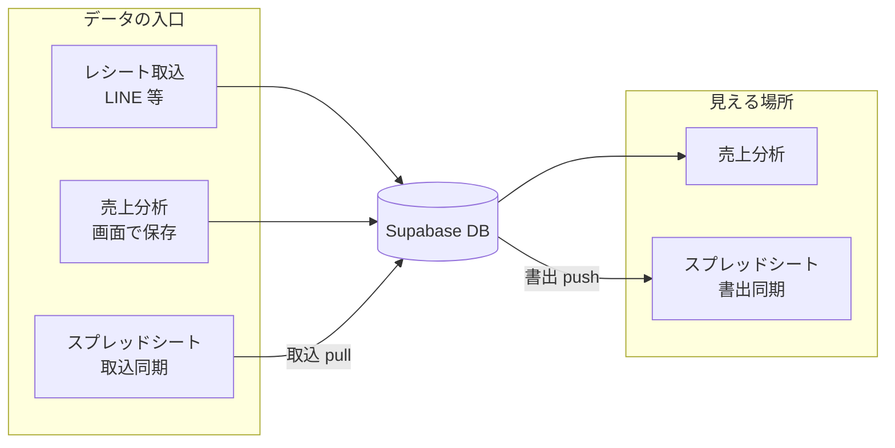

# Google スプレッドシート連携（1店舗パイロット）

最終更新: 2026-05-17 (JST)

**対象店舗（既定）**: `bistrocavacava`（BISTRO CAVA CAVA）  
**Edge Function**: `receipt-sheets-sync-cron`  
**GAS**: `google-apps-script/receipt-sheets-pilot/Code.gs`

---

## このドキュメントで分かること

- Google スプレッドシートと Supabase / 売上分析の **関係**
- **どのタブがどちらに反映されるか**（取込・書出）
- **データの正本（ソース・オブ・トゥルース）** と **優先順位**
- 売上分析とシートの内容が **食い違ったとき** どちらが採用されるか
- メニューの **双方向／取込のみ／書出のみ** の意味
- 日次売上をシートで書き換えた場合の挙動

非エンジニア向けに、運用判断に必要な部分を中心に記載しています。

---

## 1. 全体像（3つの入口と1つの正本）

売上分析（`analytics.html`）が参照する **正本は常に Supabase DB** です。  
スプレッドシートは DB の **写し・入力窓口** であり、分析画面がシートを直接読むことはありません。



| 入口 | 主な内容 | 分析への反映 |
|------|----------|--------------|
| **レシート取込** | 日次の売上・組数・客数・件数 | **自動**（同期ボタン不要） |
| **売上分析で保存** | 月間予算・按分比率・休業日・手入力前年 | **保存直後**（同期ボタン不要） |
| **スプレッドシート＋取込** | 月間予算・過去売上（＋休業日を H 列に書いた場合） | **取込 or 双方向を実行後** |

**スプレッドシート単体では売上分析は更新されません。**  
シートを編集したあとは、メニュー **「取込のみ」** または **「双方向同期」** が必要です。

---

## 2. 正本（ソース・オブ・トゥルース）一覧

「正本」とは、食い違いが起きたときに **最終的に信頼すべきデータの置き場所** です。

| データ種別 | 正本 | スプレッドシートの役割 |
|------------|------|------------------------|
| 日次売上（総売上・組数・客数・件数） | DB の `line_receipt_entries` 集計 | **書出専用**（見る・共有用コピー） |
| 月間予算額・按分比率（平日/休日前/休日） | DB の `line_sales_month_budgets` | **取込で入力可**／書出で休業日表示 |
| 休業日 | DB の `line_sales_month_store_closed_days` ＋ 予算 jsonb | 分析で保存 or 取込／**書出で H 列に表示** |
| 過去月の総売上（前年比用） | DB の `line_sales_manual_month_gross` | **取込で入力可** |

レシート明細の正本は引き続き **DB** です。シートの「日次売上」は **計算結果のエクスポート** です。

---

## 3. タブごとの方向（取込 / 書出）

| タブ名 | 手で編集 | 取込（シート→DB） | 書出（DB→シート） | 売上分析への効き方 |
|--------|----------|-------------------|-------------------|-------------------|
| **使い方** | 任意 | なし | なし | なし |
| **月間予算** | する | **する** | 休業日（H列）のみ | 取込後に予算・比率・休業日が反映 |
| **過去売上** | する | **する** | なし | 取込後に前年比に反映 |
| **日次売上** | **しない**（上書きされる） | **しない** | **する**（全行上書き） | レシート→DB で既に反映済み |
| **同期ログ** | しない | なし | 同期のたびに1行追加 | なし |

旧い英語タブ名（`monthly_budgets` 等）も読み書き可能ですが、運用は **日本語タブ名** を推奨します。

Excel テンプレート: `templates/receipt-sheets-pilot/BISTRO_CAVA_CAVA_売上連携パイロット.xlsx`

---

## 4. 同期メニューの意味（GAS）

スプレッドシートを開くと **「売上連携（パイロット）」** メニューが付きます。

| メニュー | 取込（シート→DB） | 書出（DB→シート） | 使う場面 |
|----------|-------------------|-------------------|----------|
| **双方向同期** | 月間予算・過去売上 | 日次売上・休業日（H列）・同期ログ | 通常はこれでよい |
| **取込のみ** | 同上 | 休業日（H列）・同期ログ ※ | シートを直したあと分析に反映したい |
| **書出のみ** | なし | 日次売上・休業日（H列）・同期ログ | 分析で保存済みの内容をシートに出したい |

※ 取込のみでも、休業日は DB→シートへ **書き戻し** します（H 列の表示を DB と揃えるため）。

### 4.1 技術メモ（運用者向け）

- 手動同期は **Google Apps Script（SpreadsheetApp）** がシートを読み書きし、Supabase Edge は **DB のみ** 更新します（`via_gas: true`）。
- サーバーから Google Sheets API で書く方式は、GCP で Sheets API 有効化が必要なため、パイロットでは GAS 方式を標準としています。
- DB 側には **1時間に1回** の自動同期ジョブ（`receipt-sheets-sync-cron-job`）もありますが、**確実なのは GAS の手動同期** です。シートを編集した直後に分析へ反映したい場合はメニュー操作を推奨します。

---

## 5. データの優先順位・食い違いのルール

### 5.1 基本原則：「最後に実行した操作が勝つ」

DB とスプレッドシートを **常時自動で突き合わせてどちらかを選ぶ** 仕組みは **ありません**。

| あなたがしたこと | 結果 |
|------------------|------|
| 売上分析で **保存** | その内容が **DB に上書き** → 分析はすぐその値 |
| **取込のみ / 双方向** の取込部分 | シートの **月間予算・過去売上** が **DB を上書き** |
| **書出のみ / 双方向** の書出部分 | **DB の内容** でシートの日次・休業日表示を **上書き** |

つまり **「分析とシートのどちらが常に正か」ではなく、「あとから同期／保存した方が、その項目について正」** です。

### 5.2 項目別の詳細

#### 月間予算（金額・平日/休日前/休日比率）

| 状況 | 採用される値 |
|------|--------------|
| シートで編集 → **取込** | **シート** |
| 分析で保存（取込していない） | **分析（DB）** |
| 分析で保存 → あとからシート取込 | **シート**（取込が後なら） |
| シート取込 → あとから分析で保存 | **分析**（保存が後なら） |

「有効」列（I列）が `TRUE` でない行は取込されません。  
店舗キー（C列）は **`bistrocavacava`** である必要があります。

#### 休業日（月間予算 H 列）— 例外あり

| 状況 | 採用される値 |
|------|--------------|
| 分析で休業日を保存 | DB に保存。分析は **即反映** |
| 取込時、H 列が **空** | **DB の休業日を維持**（シートが空でも消えない） |
| 取込時、H 列に **何か書いてある** | **シートの内容で DB を更新** |
| 書出 / 双方向（書出部分） | **DB → シート H 列**（表示用に整形して書込） |

休業日だけは「空欄なら DB を守る」例外があります。  
金額・比率にはこの例外は **ありません**（取込でシートの値がそのまま DB に入ります）。

**表示形式（書出時）**: 同月内は `5/3〜5/6、5/10` のように **月/日** でまとめて表示します。  
手入力でも `5/10、5/17` や `5/3〜5/6`、従来の `2026-05-10` 形式で取込できます。

#### 過去売上（前年比用）

| 状況 | 採用される値 |
|------|--------------|
| シートで編集 → **取込** | **シート** |
| 分析の手入力前年を保存 | **分析（DB）** |
| あとからもう一方で上書き | **後から実行した方** |

C 列（総売上円）を **空** にして取込すると、その月の手入力を **削除** します。

#### 日次売上

| 状況 | 採用される値 |
|------|--------------|
| レシートが DB に入る | **常に DB（レシート集計）** → 分析に自動反映 |
| シートの日次を手で書き換え | **分析・DB は変わらない** |
| **書出 / 双方向** | シートは **DB の再計算結果で上書き**（手入力は消える） |

**日次売上タブは「DB の内容を見るための鏡」** です。  
シートで数字を直しても売上分析には **一切戻りません**。

### 5.3 よくあるシナリオ

| やったこと | 売上分析 | スプレッドシート |
|------------|----------|------------------|
| 分析で予算 200万を保存 | 200万で表示 | 古いまま（取込・書出するまで） |
| シートで 250万に変更 → 双方向 | **250万**（取込後） | 日次・休業日も DB から更新 |
| シートの日次だけ 100万に書き換え → 双方向 | **変化なし**（レシート集計のまま） | 再書出で **元の DB 値に戻る** |
| 分析で休業日登録 → 書出のみ | 登録済み | H 列に休業日が表示される |
| シート H 列を空のまま取込 | DB の休業日は **残る** | 書出で H 列に DB の休業日が入る |

### 5.4 運用のおすすめ（ずれを防ぐ）

1. **どちらを「入力の主」にするか決める**  
   - 表計算が好き → **シートを主** → 編集後は必ず **取込 or 双方向**  
   - 画面が好き → **売上分析を主** → シートは **書出** で見た目を揃える  

2. **両方触った日は、最後にどちらで確定するか意識する**  
   - 分析を正にしたい → 分析で保存（その後シート取込しない）  
   - シートを正にしたい → シート編集 → **取込**  

3. **日次売上はシートで直さない**（直しても戻るだけ）

---

## 6. 売上分析に反映されるタイミング（同期ボタン要否）

| データ | 同期ボタンなしで分析に出る？ | 備考 |
|--------|------------------------------|------|
| レシートからの日次売上 | **はい** | DB 入稿時点 |
| 分析で保存した予算・休業日 | **はい** | 保存直後 |
| シートの月間予算・過去売上 | **いいえ** | **取込 or 双方向** が必要 |
| シートの日次売上（手入力） | **いいえ**（かつ入らない） | 設計上サポート外 |

---

## 7. 各タブのヘッダーと入力例

### 月間予算（A1〜I1）

| A | B | C | D | E | F | G | H | I |
|---|---|---|---|---|---|---|---|---|
| 対象月 | 店舗名 | 店舗キー | 月間予算円 | 平日比率 | 休日前比率 | 休日比率 | 休業日 | 有効 |

2行目の例:

```
2026-05	BISTRO CAVA CAVA	bistrocavacava	2000000	1	1.5	2		TRUE
```

### 過去売上（A1〜D1）

| A | B | C | D |
|---|---|---|---|
| 対象月 | 店舗キー | 総売上円 | 有効 |

2行目の例（**前年5月の総売上 150万円** を前年比用に登録）:

```
2025-05	bistrocavacava	1500000	TRUE
```

- **B列** 店舗キー: `bistrocavacava`  
- **D列** 有効: `TRUE`  
- 比較したい月ごとに行を追加

### 日次売上（A1〜J1）

| 日付 | 店舗キー | 店舗名 | 総売上 | 組数 | 客数 | 日別予算 | 差額 | レシート件数 | 更新日時 |

**書出時にタブ全体が上書き**されます。手編集しないでください。

### 同期ログ（A1〜F1）

| 同期日時 | 方向 | 店舗キー | 取込結果 | 書出結果 | メモ |

同期のたびに末尾へ1行追加されます。

---

## 8. DB テーブル（参照用）

| テーブル | 内容 |
|----------|------|
| `line_receipt_entries` | レシート明細（日次売上の元） |
| `line_sales_month_budgets` | 店舗×月の予算・按分重み・休業日 jsonb |
| `line_sales_month_store_closed_days` | 休業日（行単位） |
| `line_sales_manual_month_gross` | 過去月総売上（前年比・手入力） |

詳細は [`ANALYTICS_RECEIPT_SALES_AND_BUDGET.md`](./ANALYTICS_RECEIPT_SALES_AND_BUDGET.md) を参照。

---

## 9. セットアップ（初回のみ）

1. スプレッドシートをサービスアカウント（または運用アカウント）と **編集者** で共有  
2. Supabase Secrets（本番例）  
   - `RECEIPT_SHEETS_PILOT_SPREADSHEET_ID`  
   - `RECEIPT_SHEETS_SYNC_SECRET`  
   - `RECEIPT_SHEETS_PILOT_STORE_KEY`（既定 `bistrocavacava`）  
   - Google サービスアカウント（サーバー自動同期用・任意）  
3. GAS に `Code.gs` を配置し、スクリプト プロパティを設定  
   - `SUPABASE_RECEIPT_SHEETS_SYNC_URL` … `https://<project>.supabase.co/functions/v1/receipt-sheets-sync-cron`  
   - `RECEIPT_SHEETS_SYNC_SECRET` … Edge と同じ値  
4. スプレッドシートを再読み込み → メニュー **売上連携（パイロット）** → **双方向同期**

---

## 10. 確認チェックリスト

1. **同期ログ** に行が増えた  
2. **日次売上** に日別データがある  
3. **月間予算** H 列に休業日が表示されている（分析で登録済みの場合）  
4. [売上分析](https://marugo-s.github.io/LINE-management/analytics.html) で店舗・月を開き、予算・日次・前年比が期待どおり  

---

## 11. 英語タブからの移行

| 旧タブ名 | 新タブ名 |
|----------|----------|
| README | 使い方 |
| monthly_budgets | 月間予算 |
| past_sales | 過去売上 |
| daily_sales | 日次売上 |
| sync_log | 同期ログ |

リネーム後、**双方向同期** を1回実行してください。

---

## 12. FAQ（短答）

**Q. シートは DB の内容を見るためだけ？**  
A. **半分は Yes。** 日次売上・休業日の表示は DB の写し。月間予算・過去売上は **シートから DB へ入力する入口** にもなります。

**Q. 予算だけシートが分析に効く？**  
A. **予算＋過去売上（前年比）** がシート→分析に効きます。日次は効きません。

**Q. 分析とシートが違うときどちら？**  
A. **最後に「保存」または「取込」した方。** 休業日だけ H 列が空の取込時は DB を維持。

**Q. 日次をシートで直して双方向すると？**  
A. シートは **DB の値で上書きされ直る。** 分析は変わらない。

---

## 関連ドキュメント

- [`ANALYTICS_RECEIPT_SALES_AND_BUDGET.md`](./ANALYTICS_RECEIPT_SALES_AND_BUDGET.md) — 売上分析・予算・前年比の仕様  
- [`GOOGLE_DRIVE_BUDGET_SYNC_DESIGN.md`](./GOOGLE_DRIVE_BUDGET_SYNC_DESIGN.md) — 将来の Drive 連携設計（別系統）
